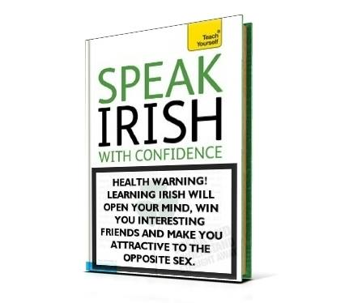

# 10 reasons why Irish is an absolutely awesome language

I have devoted a large chunk of my career to learning [Irish](http://en.wikipedia.org/wiki/Irish_language), working with Irish and making a living out of Irish. So I thought it would be fair to put together a list of reasons why I think the language is worth it. Mine are proper linguistic reasons though – none of that starry-eyed sentimental nonsense about the language being ‘beautiful’ or ‘romantic’! So, put your language geek hats on, here we go! {.lead}

 {.center}

(Many of the features mentioned here are actually common to all Celtic languages, including Scottish Gaelic and Welsh, but let’s not be splitting hairs now.)

## 1. Irish has no words for *yes* and *no*

This tends to be the first thing newcomers are told about the language, so let’s start here. You will find no equivalents for *yes* and *no* in an English–Irish dictionary because Irish has no such words. But that does not mean that yes/no questions cannot be answered in Irish. They can, of course, only you must do it by recycling the verb that came with the question. If somebody asks you **an léann tú nuachtáin?** *do you read newspapers?* you can answer **léim** *I read* for *yes* or **ní léim** *I don’t read* for *no*.

Surprisingly, in spite of centuries of language contact with English, Irish has held on to this way of speaking and hasn’t evolved or borrowed simple one-word expressions for agreeing and disagreeing. True, people sometimes say things like *yeah* and *nah* in informal speech, but these seem more like brief code-switches to English than a feature of Irish, and are strictly limited to the informal register. Written Irish, even informal written Irish, almost never avails of these tricks and sticks to its traditional device of recycling the verb.

What this means in practical terms is that Irish speakers cannot easily dismiss a question or offer without giving it some consideration. Unlike English or German or French where you can say *no* or *nein* or *non* to pretty much anything without giving it any thought, an Irish question needs to be processed more deeply.

## 2. Irish has inflected prepositions

Prepositions are words like *with* and *for* and *on*. In most languages they’re pretty boring and never change, but in Irish they inflect for person and number. Yes, prepositions inflect! From **le** *with* we have **liom** *with me*, **leat** *with you*, **leis** *with it* and so on. From **ar** *on* we have **orm** *on me*, **ort** *on you*, **air** *on it* and son on. You get the idea. It’s a pretty simple concept to get your head around in theory, but if you’re a learner of Irish as a second language, it’s easy to get confused and start saying things like \***le mé** instead of **liom** *with me*, \***ar tú** instead of **ort** *on you*. Learner beware!

## 3. Irish words change their beginnings (and not just their endings)

Words in most languages inflect, which is a fancy way of saying that their endings change depending on the role they play in the sentence. Irish words do that too. But Irish words also change their beginnings! These changes are called *initial mutations* and they are usually caused by something that precedes the word, such as prepositions or determiners. So from **teach** house we have **mo <u>th</u>each** *my house* and **i <u>dt</u>each** *in a house*, from **bord** *table* we have **do <u>bh</u>ord** *your table* and **ar an <u>mb</u>ord** *on the table*, from **athair** *father* we have **an <u>t-</u>athair** *the father*, **a <u>h</u>athair** *her father* and **ár <u>n-</u>athair** *our father*. Note that the initial mutations are not just orthographical, the pronunciation changes too: **teach** starts with a /t/ sound, **theach** with /h/ and **dteach** with /d/.

The fact that words change their pronunciation a little on account of other words around them is not [unusual](http://en.wikipedia.org/wiki/Sandhi) in the world’s languages. French has [liaison](http://en.wikipedia.org/wiki/Liaison_%28French%29), for example. But in Irish (and other Celtic languages), these changes have evolved from a purely phonological phenomenon into an omnipresent feature of the syntax. Irish initial mutations are used for things like gender and number agreement, and they are not merely an artefact of the linear ordering of words next to each other.

For a language learner, initial mutations bring some surprising complications. It can be difficult to look up an unknown word in a dictionary if you’re not sure whether it’s mutated or not. Fortunately, the typical character sequences produced by initial mutations are easy to spot once you’ve been around the block a few times.

Also, initial mutations produce some orthographical oddities that may appear as typos to the uninitiated. Some initial mutations work by prefixing a character to the beginning of a word. When the word needs to be capitalized, the prefixed letter must remain in lowercase. For example, for the placename **Gaillimh** *Galway* we have **i nGaillimh** *in Galway*. That’s right, the word now has a lowercase ‘n’ followed by an uppercase ‘G’. This is not a typo, it’s just how Irish orthography works!

## 4. Irish sentences start with the verb

Practically all languages on Earth have a default word order for their sentences. In English and most other European languages it is subject → verb → object, for example: **the woman** (= subject) **kissed** (= verb) **the man** (= object). In some languages it is subject → object → verb, like in Latin. But you rarely see a language where the basic ordering is verb → subject → object and each sentence begins with a verb. And you’ve guessed it, Irish is one such language (and so are the other Celtic languages). We have **phóg an bhean an fear,** literally *kissed the woman the man*, and **tá an fear sásta**, literally *is the man happy*. But in case you’re wondering, these are not questions! Unlike English, where you only use this order for questions, Irish sentences are always like this.

The verb-initial word order has some interesting implications that you need to bear in mind when constructing sentences in Irish. Because the subject and the object are now right next to each other with no verb in between, it can sometimes be difficult to tell where the one stops and the other begins. In the sentence **tá an fear sásta** we do not know straight away whether this is a complete sentence meaning *the man is happy* or whether it’s just the beginning of a larger sentence starting with *the happy mean is...* Also, you need to keep your subjects short in Irish. The longer the subject is, the harder it is for the reader or listener to recognize when it has ended. In English, a sentence like *the man who has been kissed by the woman who had previously rejected him is happy now* is OK in English – at least sort of, it’s legible. But its literal Irish translation would be pretty difficult to parse mentally because there’d be no verb to give the reader a clue that the subject has ended: the reader would probably feel compelled to stop and do a double take.

## 5. Irish words inflect for contrast

In addition to inflecting nouns for number and case like practically every language on Earth, Irish also inflects its nouns for something we can call contrast or emphasis. Basically, a noun can come in two forms, a default ‘normal’ form and a derived ‘contrasted’ or ‘emphasized’ form created by adding a suffix, usually **-sa** or **-se**. This can usefully produce contrasted pairs such as **mo theach** *my house* versus **mo theach<u>sa</u>** *my house and not someone else’s*. Pronouns inflect for contrast too, so for every **mé** *me* we have **mise** *myself and no-one else*, for every **tú** *you* we have **tusa** *yourself and no-one else*.

It is practically obligatory in Irish grammar to use these contrastive forms when some kind of semantic contrast or juxtaposition occurs, for example: **feicim mo theach, ach cá bhfuil do theach<u>sa</u>?** *I see my house but where is <u>your</u> house?* **tá mé go maith, conas atá <u>tusa</u>?** *I am fine, how are <u>you</u>?*

You will probably agree that inflection is an unusual way to achieve semantic contrast. Mainstream European languages normally use nothing more than prosodic stress for these purposes, while some languages also use word order. But only Irish plus its Celtic cousins have evolved a contrastive device that functions at the level of inflectional morphology. Not that prosodic stress and word order cannot be used for this purpose in Irish too, but it is optional. It tends to be used a lot less than in English and must always be accompanied by contrastive inflection, which is never optional.

## 6. Irish has several verbs *to be*

It seems simple to use the verb *to be* in English, as in *the house <u>is</u> small* or *my mother <u>is</u> a singer* or *that woman <u>is</u> our teacher*. It’s always some form of the same verb, *to be*. But Irish has different ways for saying these things, depending on the meaning.

The basic verb *to be* is **bí** in Irish or, in the present tense, **tá** *is*. It can be used for situations when you’re simply attributing a property to an entity, such as the property **beag** *small* to the entity **an teach** *the house*. This is easy and it takes care of our first sentence: **tá an teach beag**, *the house is small*.

The remaining two sentences cannot be translated with this verb because they imply a different kind of ‘being’. Let’s tackle sentence number two first: *my mother is a singer*. The sentence expresses class membership: a relation between an entity (**mo mháthair** *my mother*) and a class the entity belongs to (**amhránaí** *a singer*). You cannot use the verb **bí** here: \***tá mo mháthair amhránaí** is wrong, hand-wringingly wrong. To express the class membership relation in Irish, you must use a construction called the *classifying copula*: **is amhránaí í mo mháthair**. It uses the defective verb **is** (whose similarity to the English *is* is probably purely coincidental) and can be translated literally as: *is a singer, she, my mother*.

The third one, *that woman is our teacher*, is different again. It expresses a relation between two linguistic labels (**an bhean sin** *that woman* and **ár múinteoir** *our teacher*) and tells you that they both refer to one and the same entity, that they are one and the same person. For this you must use a construction called the *identity copula*: **is í ár múinteoir í an bhean sin**, literally: *is she our teacher, she, that woman*. This again uses the defective verb **is**, but in a different pattern.

So here we have the three basic ways of saying that something ‘is’ something in Irish. There are more twists and turns to the story but we won’t go into the details here. As you can see from this extremely basic introduction, it’s more complicated than English or most other European languages because you must pay close attention to the nature of the relation that your ‘is’ expresses. As you can imagine, this poses great difficulty for second-language learners of Irish who keep wanting to use the basic verb **bí** everywhere. But if you’re like me and if you have experience in object-oriented computer programming, you won’t find it so difficult. Think about it like this: the classifying copula is basically a relation between a class and an instance, while the identifying copula is like two variables referring to the same object. See? Speaking Irish is like programming in an object-oriented programming language!

## 7. Irish numerals are delightfully and/or hideously complicated

Irish has two sets of numerals, one for counting humans and another for counting animals and non-living things (house pets are a borderline case, they can go either way). The human numerals are actually nouns whose literal meanings are *a two-person group* (**beirt**), *a three-person group* (**triúr**), *a four-person group* (**ceathrar**) and son on. You can combine them with another noun (in the genitive plural) to say things like *four women*: **ceathrar ban**, literally *a four-person group of women*; *three drivers*: **triúr tiománaithe**, literally *a three-person group of drivers*; *two parents*: **beirt thuismitheoirí**, literally *a two-person group of parents*. You are not supposed to combine these numerals with the word **daoine** *people* though, because they already have the meaning of *people* sort of ‘baked’ into them. A phrase like \***triúr daoine** *three people* sounds a bit wrong because it literally says *a three-person group of persons*. To say *three people*, just say **triúr** on its own.

The numerals used for counting animals and non-living things have quirks of their own too. First of all, they can be subdivided into two further subsets, one for just saying numbers on their own (*one, two, three...*) and another for combining a numeral with a noun phrase (*one house, two fast cars, three very large eggs...*). And combining numerals with noun phrases is surprisingly complex in Irish: different numbers cause different mutations on the noun, the noun is in most cases supposed to be in the singular (yes, singular! – you say things like **trí ubh**, literally *three egg* in Irish) but any adjectives are supposed to be in the plural and mutated. The rules are so curiously complex you could spend half your career just trying to figure them out. I have written a [40-page monograph on Irish numerals](http://www.lexiconista.com/pdf/Uimhreacha.pdf) and still I don’t think we’re friends.

And that’s only the express-train overview. There are several complicating details, including lots of exceptions, lots of dialectal differences and the inconvenient fact that Irish isn’t actually used much in the higher echelons of mathematics and statistics. And then there is the competing *vigesimal* system, based on multiples of 20, which overlaps and intertwines with the 10-based *decimal* system. The whole thing is a can of worms waiting to explode in your face if you as much as tap on it. In fact, I’m not so sure any more whether Irish numerals make the language absolutely awesome or hideously ingrown. I know that numerals can sometimes be very complex in human languages, so this is not completely unexpected. But what I’ve seen in Irish, I haven’t seen anywhere else.

## 8. Irish is strongly periphrastic

Many of the concepts that other European languages have a single word for, Irish expresses them with a multi-word expression. Such constructions are called *periphrastic* and they are everywhere in Irish! To be *ill* is to ‘have an illness on you’ (**tá tinneas ort**). To *like* something is ‘it is good with me’ (**is maith liom é**). To *prefer* something is ‘it is better with me’ (**is fearr liom é**). To *interview* someone is to ‘put an interview on them’ (**agallamh a chur orthu**). To *try* something is to ‘extract an attempt from it’ (**bain triail as**). To *bleed* is to ‘be putting blood’ (**ag cur fola**). To *visit* somebody is to ‘give a visit upon them’ (**cuairt a thabhairt orthu**). To *sleep* is to ‘be in your sleep’ (**bí i do chodladh**). To *live* somewhere is to ‘be in your residence’ there (**bí i do chónaí**). To *press* something is to ‘put pressure on it’ (**cuir brú air**). To *love* somebody is to ‘be in love’ with them (**tá mé i ngrá leat**).

Even though some of these concepts do have verbal equivalents (**brúigh** *press*, **gráigh** *love*), they are pretty much only theoretical and are almost never used in natural free-flowing conversation. In general, Irish is a language with very few verbs, compared to other European languages – and the few verbs it has, it uses them mostly as semantically void auxiliaries (**cuir** *put*, **tabhair** *give,* **déan*** do*) where the main semantic content rests in the accompanying nouns and adjectives.

## 9. Irish explains (much of) Irish English

If you’ve ever wondered why Irish people say things like *I’m after breaking a cup* and *I do be coming here often*, it’s because these constructions have been carried over from Irish into Irish English. They are more or less literal translations of how the meanings are expressed in Irish. The first one is an example of how the perfect past tense of a verb is constructed in Irish using the preposition **tar éis** *after*: **tá mé tar éis cupán a bhriseadh**, literally *I am after breaking a cup*, more idiomatically *I have broken a cup*. The second one is an example of how Irish verbs are used in the progressive habitual tense to express occurrences that happen often or regularly: **bím ag teacht anseo go minic**, literally *I do be coming here often*, more idiomatically *I come here often*.

The history of language contact between Irish and English on the island of Ireland is long and not always without trouble. You could summarize it in two phases. At first, Irish had the upper hand and it influenced the local variety of English a lot, giving it features that survive in the English spoken by Irish people today, even those who don’t have a word of Irish themselves. Then the balance of power changed and English has become the dominant language for most inhabitants of Ireland. All who speak Irish also speak English, but not the other way around. What’s more, those who speak both languages often have English as their stronger, more fluent, more expressive language. This brings a lot of anglicisms into Irish, even to such an extent that some people’s speech would be incomprehensible if you didn’t also know English.

Irish and English are not easy bedfellows because they are typologically so different. But, by the coincidence of history, they have been pushed together and have been exchanging features for centuries. So the story of Irish is also the story of Irish English, and vice versa.

## 10. Irish is a stage door to Ireland

Even though Irish is very much playing second fiddle to English in Ireland now and even though you can spend a full life here in happy ignorance of the language, it still pays to know Irish. If you know Irish, you’ll know how to pronounce Irish-language placenames like **Baile Átha Cliath** and **Dún na nGall** on bilingual roadsigns and you’ll be able to decipher what they mean (on the other hand, English-language placenames in Ireland are usually meaningless gobbledygook converted from the Irish by a method of ‘jot down how it sounds to an English person’). You’ll know how to pronounce people’s names, especially first names like **Séamus** and **Aonghus** and **Siobhán** and **Aisling**, as these are very popular among Irish people, even those who don’t actually speak any Irish. More importantly, you’ll know which ones are male and which female! You’ll know your way with people’s surnames too: for example, you’ll know that the surname **Ó Séaghdha** seems like it contains a lot of graphemes but the pronunciation is only three phonemes. Many institutions and functions in Irish public life have Irish-language names including **Dáil** (the lower chamber of parliament), **Taoiseach** (the prime minister) and **Bus-Áras** (the central bus station in Dublin); if you know Irish you’ll know how to pronounce them properly (unlike the newsreaders in RTÉ who are often disappointingly off-target) and you’ll understand what they mean literally.

In other words, Irish will give you a more direct line to Ireland than English. This is a particularly attractive proposition if you’re a newcomer to Ireland like I once was. Through Irish, you can meet interesting people, become involved in interesting projects and feel welcome like someone who belongs. And perhaps that, more than anything, is the reason why Irish is an absolutely awesome language.
