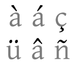

# Living with a diacritic

No, this is not an article about living with an obscure illness. It’s an article about living with a name no-one can spell correctly. {.lead}

---

{.floatRight}

You see, my surname is <em>Měchura</em> and the second letter from the left is adorned with a diacritic called a <a href="http://en.wikipedia.org/wiki/Caron">caron</a>. This diacritic is used a lot in Czech, the language of the Czech Republic, which is where both my name and I are from. It is not used a lot in Ireland, though, which is where both my name and I live now. So we both end up being misspelled a lot.

Most of the time, people simply drop the diacritic and I become a <em>Mechura</em>. It’s not ideal but I can live with it. What’s worse is when people try and fail and misspell my name as <em>Méchura</em> or <em>Mëchura</em> or <em>Mĕchura</em> or some such. Of these, the last one is the most sneaky because it confuses the Czech caron for the Turkish <a href="http://en.wikipedia.org/wiki/Breve">breve</a>. The caron has a sharp angle like a small ‘v’  while the breve is curved like a small ‘u’. It’s disappointing when people don’t appreciate the difference.

Is this a huge problem? Well, I guess it isn’t, it’s not like I’m being hurt or robbed or anything. But it is annoying when it keeps happening again and again. Like I said, I could live with it when people just drop the diacritic because they don’t know what to do about it. At least that’s being honest. What gets me is when people try to approximate it somehow but don’t care enough to get it completely right. I do appreciate the goodwill but don’t appreciate the lack of ability or perseverance or whatever to do it properly. Each time it happens, I can almost hear the “ah sure that’ll do” that must have been going through their mind.

What comforts me is that I’m by far not the only person affected buy this. It is common in English-speaking countries for people to be completely clueless when it comes to recognizing and writing diacritics from languages that, like English, use the Latin alphabet but, unlike English, adorn it with diacritical marks. And so things like people’s names and foreign placenames are butchered on a daily basis.

In the interest of fairness, this problem is not limited to English-speaking countries. Even in those Continental European countries that have their own fair share of diacritics, people are quite often quite clueless about diacritics from other, neighbouring countries. That’s why you see so many Hungarian names, which should contain the <a href="http://en.wikipedia.org/wiki/Double_acute_accent">Hungarian Umlaut</a> (as in <em>Petőfi</em>) misspelled with the <a href="http://en.wikipedia.org/wiki/Umlaut_%28diacritic%29">German Umlaut</a> (as in <em>Petöfi</em>). It’s such a shame that this keeps happening. We’ve been living this heady European dream of “<a href="http://en.wikipedia.org/wiki/In_varietate_concordia">unity in diversity</a>” (the EU’s official motto) for some two generations now and still we can’t even copy and paste each other’s names correctly?

Fortunately there are other people beside myself who care about this. Some years ago I came across a campaign called <a href="http://www.multialphabetism.eu/">Multialphabetism</a> run by Bernd Kappenberg from Brussels. Its goal is to educate the general public about the various alphabets of Europe so that people can finally stop butchering each other’s texts unintentionally. Mr Kappenberg has also suggested that there should be an EU-wide legal right to have your name spelled correctly by the authorities, according to the conventions of your own language, regardless of where in the EU you live – so that I, a Czech EU citizen, might one day have a legal right to see my name on letters from the Irish Revenue and on the Irish electoral register spelled as <em>Měchura</em> instead of some sorry approximation. I like the multialphabetism campaign so much I’d even give it money if I were rich.

Campaigning for multialphabetism isn’t going to be without friction. I can already hear the excuses: “the computer can’t do it” or “the software we use can only handle English (or German, Spanish, …) letters”. But this kind of whining usually has nothing to do with technology and everything to do with people’s ignorance. We already have the technology to handle practically any alphabet on Earth, and we’ve had it for more than a decade. It’s called <a href="http://en.wikipedia.org/wiki/Unicode">Unicode</a>, it’s a standard for encoding characters from any language known to man, and every major software package in use today supports it. More often than not, the problem is not in the computer, it’s somewhere between the computer and the chair: in the person who doesn’t know how to use the software properly, doesn’t care and couldn’t be bothered to find out. And so they blame the computer instead. A small bit of training, for example as part of one of those trendy “multicultural awareness” programmes, would reduce the task to a triviality and the problem would cease to exist.

Granted, there may be cases when the software genuinely can’t handle foreign characters. But if anybody out there is still using such software and if that software was created in the last ten years, then that piece of software is a <em>Mißgeburt</em> that should never have seen the life of day. Whoever commissioned or bought it should have known enough to ask for Unicode support, and even if they hadn’t asked, Unicode support should been included anyway because that’s the industry standard.

The drive towards multialphabetism is much more important in the world today than it ever was before. In today’s globalized world, it is becoming more and more common for people to come in contact with names and other textual artefacts from foreign countries and foreign languages. It is time people started treating each other’s textual artefacts with respect, and respect here means not misspelling them out of ignorance (honest typos are excused). Because practically all text that matters is processed on computer these days, the task of educating people about multialphabetism is identical to the task of educating people about computers. Computer users need to be brought up to date with the “multialphabetical” features that their computers have had for some time but which they may have ignored until now. If you’re a Windows user, I suggest you go to Start → Accessories → System Tools → <a href="http://tlt.its.psu.edu/suggestions/international/accents/charmap.html">Character Map</a> and start exploring. You may even find it’s fun.
