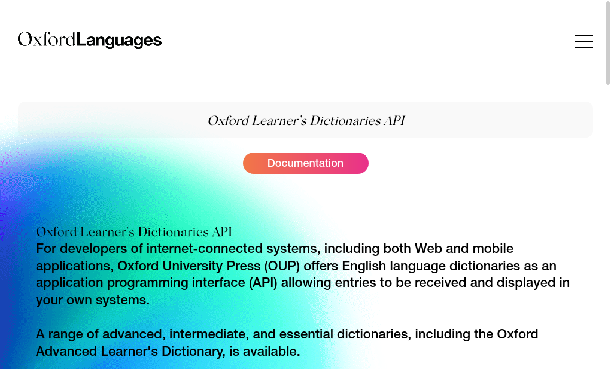

# A survey of dictionary APIs

A survey of application programming interfaces (APIs) on the Internet which provide access to lexicographic content in machine-readable formats. This page accompanies my talk **Lexicographic APIs: the state of the art** at the [eLex 2021 Conference](https://elex.link/elex2021/). {.lead}

---

 {.shrink floatRight}

## Lexicala API

By K Dictionaries (formerly Kernerman Dictionaries), the publishers of many mostly bilingual dictionaries, including the well-known Password series of "bilingualized monolingual" learners' dictionaries. The API contains many monolingual and bilingual dictionaries in 50+ languages.

URL
: [https://api.lexicala.com/](https://api.lexicala.com/)

API format
: REST + JSON.

Usable free account
: Yes.

Publicly available documentation
:  Yes.

Entry format
: JSON.

Entry schema
: Their own.

---

 {.shrink floatRight}

## Oxford Dictionaries API

By Oxford University Press. The API contains several monoligual English dictionaries (intended for for native speakers of English) and bilingual dictionaries in 30+ languages paired with English.

URL
: [https://developer.oxforddictionaries.com/](https://developer.oxforddictionaries.com/)

API format
: REST + JSON.

Usable free account
: Yes.

Publicly available documentation
:  Yes.

Entry format
: JSON.

Entry schema
: Their own.

---

 {.shrink floatRight}

## Oxford Learner's Dictionaries API

Yet another API by Oxford University Press. This one is for their monolingual English dictionaries for learners.

URL
: [https://languages.oup.com/oxford-learners-dictionaries-api/](https://languages.oup.com/oxford-learners-dictionaries-api/)

API format
: REST + JSON or XML.

Usable free account
: Yes.

Publicly available documentation
:  Yes.

Entry format
: XML or HTML.

Entry schema
: Their own.

---

 {.shrink floatRight}

## Macmillan Dictionary API

By Macmillan, the publisher of a monolingual English dictionary for learners. The API gives access to this dictionary.

URL
: [https://www.macmillandictionary.com/tools/aboutapi.html](https://www.macmillandictionary.com/tools/aboutapi.html)

API format
: Unclear, probably REST.

Usable free account
: Yes.

Publicly available documentation
:  No, you need to sign up first.

Entry format
: No information available, you need to sign up to find out.

Entry schema
: No information available, you need to sign up to find out.

---

 {.shrink floatRight}

## Cambridge Dictionaries API

By Cambridge University Press. The API gives access to their monolingual English dictionaries for learners.

URL
: [https://dictionary-api.cambridge.org/](https://dictionary-api.cambridge.org/)

API format
: REST + JSON.

Usable free account
: No. Trial account for 30 days.

Publicly available documentation
:  Yes.

Entry format
: XML or HTML.

Entry schema
: Their own.

---

 {.shrink floatRight}

## PONS Dictionary API

An API for bilingual dictionaries in 13 languages with German, from the German dictionary publisher PONS.

URL
: [https://de.pons.com/p/online-woerterbuch/fuer-entwickler/api](https://de.pons.com/p/online-woerterbuch/fuer-entwickler/api)

API format
: REST + JSON.

Usable free account
: Yes.

Publicly available documentation
:  Yes.

Entry format
: JSON.

Entry schema
: Their own.

---

 {.shrink floatRight}

## Merriam-Webster Dictionary API

An API for a few monolingual English, an bilingual with English, dictionaries by the US dictionary publisher Merriam-Webster.

URL
: [https://dictionaryapi.com/](https://dictionaryapi.com/)

API format
: REST + JSON.

Usable free account
: Yes.

Publicly available documentation
:  Yes.

Entry format
: JSON peppered with some home-baked inline makup.

Entry schema
: Their own.

---

 {.shrink floatRight}

## Collins API

Collins is the publisher of the legendary Collins COBUILD monolingual dictionary for learners of English. This API provides access to that dictionary, and to a handful of their other bilingual dictionaries with English.

URL
: [https://www.collinslanguage.com/collins-api/](https://www.collinslanguage.com/collins-api/)

API format
: Unclear, probably REST.

Usable free account
: Yes.

Publicly available documentation
:  No, you need to sign up first.

Entry format
: No information available, you need to sign up to find out.

Entry schema
: No information available, you need to sign up to find out.

---

 {.shrink floatRight}

## ABBYY Lingvo dictionaries API

An API for 15 bilingual dictionaries (with Russian) from the Russian dictionary publisher ABBYY.

URL
: [https://developers.lingvolive.com/](https://developers.lingvolive.com/)

API format
: REST + JSON.

Usable free account
: Yes.

Publicly available documentation
:  Yes.

Entry format
: JSON (highly complex, with lots of inline markup).

Entry schema
: Their own.
