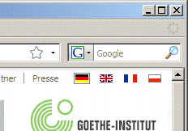

# Flags as language symbols – so what is the problem?

Using country flags as if they were language symbols is bad. So why does everybody keep on doing it? And is it really so bad? {.lead}

---

{.floatRight}

Anybody who’s ever visited a bilingual or multilingual website has probably noticed a little widget somewhere in the corner that allows you to switch between all the different language versions. Very often, this language selector uses flags as graphical symbols. It seems like a simple enough idea: you click on the French flag for the French version, the Polish flag for the Polish version, the Russian flag for the Russian version, and so on. It is, however, a very bad idea, at least if you listen to most of the software globalization industry’s theoreticians. There is no shortage of articles and blog posts criticizing the practice. The classic is Jukka Korpela’s “<a href="http://www.cs.tut.fi/~jkorpela/flags.html">Flag as a symbol of language - stupidity or insult?</a>” from 1997, and you don’t have to google (or is it <em>bing</em> these days?) very long to find other tirades in the same vein (<a href="http://www.jankoatwarpspeed.com/post/2008/10/27/You-should-never-use-flags-for-language-choice.aspx">here</a>, <a href="http://www.btitze.net/flags_vs_languages.html">here</a>, <a href="http://www.globalbydesign.com/blog/2008/01/31/flags-and-languages-dont-mix/">here</a>, <a href="http://canonical.wordpress.com/2008/10/27/using-flags-for-language-choice/">here </a>and <a href="http://imagexmedia.com/support/faqs/general-questions/how-should-language-selection-be-displayed-web">here</a>). This opinion has even been <a href="http://www.w3.org/TR/i18n-html-tech-lang/#ri20040808.173208643">sanctioned officially</a> by the W3C Working Group on Internationalization.

Before I reveal what I have to say on the subject myself, let’s review what others have said. The usual argument against the practice is one of logic: flags are actually symbols of countries, not of languages, and there is no one-to-one correspondence between the two. Some languages are spoken in more than one country and some countries have more than one language spoken in them. Therefore it is illogical to use flags as symbols for languages.

Let there be no mistake – I agree with the argument. It is not only illogical but also potentially insulting and confusing. It is insulting because why should an English speaker from Ireland have to click on a Union Jack to access the English-language version of a website? It is confusing for the same reason. I remember witnessing a group of boy and girl scouts from Ireland who were preparing to go to a jamboree in the Czech Republic. They were looking at the event’s website and it genuinely didn’t occur to them that they needed to click on the little Union Jack in the corner to go to the English version.

This is where the argument usually stops: flags as symbols for languages are bad, therefore don’t do it. But still, people continue doing it. However much the software globalization community argues against it, there is no shortage of websites and software using flags in this way. Why?

To begin answering that question, we need to revisit the “argument of logic”. It says that there isn’t a one-to-one correspondence between countries and languages. While that is true in principle, the reality is that in many specific cases, there actually <em>is</em> a one-to-one correspondence. Slovak is pretty much only spoken in Slovakia. Estonian in Estonia. Japanese in Japan. And even though there are many multilingual countries in the world, the association between a particular country and a particular language is stronger than we, logically thinking software developers, may think. The very concept of “country” is closely linked to language. Pretty much all the nation-states as we know them today originated from a 19th-century wave of nationalism which conflated the notions of nation, language and state into a single ideal to aspire to. Throughout history, various peoples have gone to great length to achieve that ideal, up to and including the fighting of wars. Not many countries have actually achieved it, but the ideal still lives in the popular subconscious. Add to that the convenience of graphics (“pictures speak louder than words”) and you have an almost irresistible temptation to reach for flags as symbol for languages, even if it’s theoretically “bad”.

What does all this heady talk mean for the software globalization industry? It means that however hard we try to persuade the world not to do it, the naive practice of using flags as language symbols isn’t going away anytime soon. We need to deal with it in a smarter way then simply dismissing it as “stupid”. I for one think that using flags as symbols for languages is harmless in situations where a one-to-one correspondence exists, such as Slovak or Estonian. But I also think that when such a correspondence doesn’t exists, then flags shouldn’t be used. There is really no excuse for sticking on a Union Jack and presuming that everybody in the world will understand and accept that it means “click here for English”. I think we need to be flexible in designing our language-swapper widgets: by all means let’s use flags for languages where that makes sense but always accompany them with a textual link, and leave the flag out for languages where that could be confusing or insulting.
