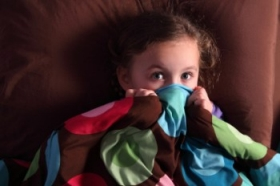

# Mar a d’imir páistí marú na muice

Jacob agus Wilhelm Grimm {.subtitle}

Foilsíodh an scéal seo sa chéad eagrán de bhailiúchán scéalta do pháistí ag na deartháireacha Grimm sa bhliain 1812. Fágadh amach é as na hatheagráin ina dhiaidh sin. Léigh leat go dtuige tú cén fáth. {.meta}

---

{.floatRight}

Tráth den saol bhí athair, máthair agus triúr páistí ina gcónaí ar fheirm. Lá amháin rinne an t-athair muc a mharú agus chonaic beirt de na páistí is sine é. Nuair a tháinig fonn spraoi orthu tráthnóna, dúirt buachaill amháin leis an bhuachaill eile: “tusa an mhuc, mise an búistéir”. Tharraing sé scian amach agus ghearr sé scornach a dhearthár gur mharaigh sé é.

Bhí an mháthair thuas staire ag tabhairt folcadh don leanbh a b’óige. Chuala sí screadaíl agus rith sí anuas. Nuair a thuig sí a raibh tarlaithe, tháinig fearg chomh mór sin uirthi go bhfuair sí greim ar an scian agus sháigh sí í in ucht a mic, a bhí i bpáirt an bhúistéara, agus mharaigh sí é.

Ansin chuimhnigh an mháthair go raibh an leanbh dearmadta san fholcadán aici. Rith sí ar ais ach, mo léan, bhí an leanbh báite idir an dá linn. D’éirigh an bhean chomh céasta ag an ár ar fad agus ag a cuid peacaí gur chroch sí í féin an tráthnóna sin. Tháinig athair an tí abhaile ag deireadh an lae agus cé nár chuir seisean lámh ina bhás féin, níorbh fhada ina dhiaidh sin go bhfuair sé bás leis an bhrón.
