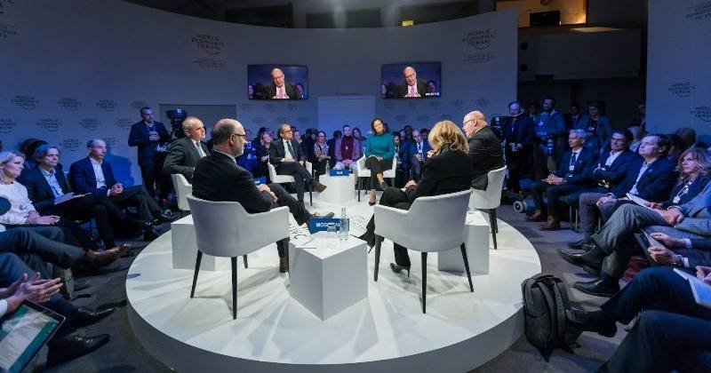

Duine de na scríbhneoirí is bisiúla – agus is mó díol – ár linne é [Michal Viewegh](https://en.wikipedia.org/wiki/Michal_Viewegh) i bpobal na Seicise. Úrscéalaí é go príomha, agus tá cuid mhaith dá úrscéalta iompaithe ina scannáin fiú. Mar is iondúil do scríbhneoirí na Mór-Roinne tá an-chuid colún scríofa aige do na nuachtáin freisin, agus seo aistriúchán ón tSeicis ar cheann díobh: ‘Jak se dělá talk show’ ón bhliain 1999, a foilsíodh sa chnuasach ‘Švédské stoly aneb Jací jsme’. {.preintro}

# An dóigh a ndéantar clár cainte

Michal Viewegh {.author}

Is mar seo a bhíonn sé de ghnáth: faigheann tú glaoch ó thaighdeoir i stáisiún teilifíse éigin ina gcuirtear in iúl duit go bhfuil siad ag ullmhú clár cainte ar ábhar éigin, abair “an iriseoireacht agus an eitic”, agus gur mhór leo dá mbeifeá sásta páirt a ghlacadh ann. Má thugann tú le fios go bhfuil drogall ort, déarfaidh sí leat go bhfuil duine eile de na haíonna, duine éigin mór le rá, ag iarraidh tú a bheith i láthair, tusa go speisialta. Glacfaidh tú leis an chuireadh ar an toirt, dar ndóigh.

Ansin tiocfaidh an taighdeoir chuig an chuid is tábhachtaí den ghlaoch: cúrsaí iompair agus taistil. Déanfaidh sí cur síos ar an charr a sheolfar chun tú a bhailiú, cén dath a bheidh air, cén t‑ainm a bheidh ar an tiománaí. Meabhrófar an t‑eolas seo duit i nglaoch eile níos gaire don lá, ar eagla na heagla. Fíorbheagán a nochtfar duit faoi ábhar an chláir féin, áfach. Socrófar é sin níos déanaí, sin an freagra a gheobhaidh tú má chuireann tú ceist.

B’fhéidir go mbeidh ceist eile agat ansin: cé hiad na haíonna a bheidh i láthair in éineacht leat? Ní bheidh drogall ar an taighdeoir liosta na ndaoine sin a roinnt leat. Rud nach roinnfidh sí leat, áfach, gur liosta é seo de dhaoine a fuair cuireadh, seachas daoine a ghlac leis an chuireadh. Formhór díobh, beidh siad níos ciallmhaire ná tusa agus diúltóidh siad. Ní bheidh rogha eile ag an taighdeoir ansin ach daoine iomlán eile a tharraingt isteach, an dara haicme mar dhea. Astu sin, glacfaidh formhór leis na chuireadh.

Mar sin, agus tú tagtha sa stiúideo ar an lá, feicfidh tú daoine nach raibh súil agat leo, agus beidh i bhfad an iomarca díobh ann. Naonúr saineolaí ar chúrsaí iriseoireachta agus eitice! Ní raibh a fhios agat go raibh an méid sin sa tír fiú. Má thógann tú ceist faoi seo agus má fhiafraíonn tú den taighdeoir nár leor beirt nó triúr do chlár leathuair an chloig, déanfaidh sí gáire trócaireach agus míneoidh sí duit nach féidir clár cainte spreagúil a dhéanamh le beirt nó triúr.

Agus an smideadh á chur ort, míneofar rud eile fós duit: tháinig athrú beag ar ábhar an chláir, agus is ar an “iriseoireacht i gcoitinne” a bheifear ag caint anois. Aithníonn an láithreoir go bhfuil tú beagáinín míshásta faoi sin, agus mar chúiteamh, is ortsa a chuirfidh sé an chéad cheist sa chlár.

“An maith an rud é, crosfhocal a bheith sa nuachtán?” a fhiafróidh sé díot go fiosrach.

Le dua, fáisceann tú dhá abairt bhacacha asat. An ceann díobh atá leathchiallmhar féin, gearrfar amach é. Agus sin a bhfuil duit, ní bhfaighidh tú deis cainte eile go deireadh an chláir – go háirithe más duine tú nach bhfuil sásta gearradh isteach ar dhaoine eile. Ní miste leat é sin agus caitheann tú an chuid eile den chlár ag faire ar an dóigh a ndéantar clár cainte, chun colún tarcaisneach a scríobh faoi níos déanaí. Ní fada go dtuigfidh tú an bunphrionsabal: chomh luath is a thosóidh duine éigin ag rá rud éigin substaintiúil, caithfidh an láithreoir an deis cainte a bhaint de.

Agus an taifeadadh críochnaithe, cailleann gach duine suim ionat láithreach. An t‑aon rud atá fós i ndán duit sa stiúideo seo ná an táille a bhailiú. I do chás-sa is airgead mór é – má amharcann tú air mar tháille in aghaidh abairte. Sa bhaile duit, ólann tú gloine nó dhó fíona chun dearmad a dhéanamh den rud ar fad agus téann tú a luí.

Craolfar an clár agus athchraolfar é – i ngeall ar a fheabhas, gan dabht. Tosóidh do chairde ag glaoch ort agus ag fiafraí, cén fáth faoin spéir a raibh tú sásta páirt a ghlacadh ina leithéid? Ar son airgid? Agus, in ainm Dé, cén fáth a raibh naonúr aíonna ann? Nár leor beirt nó triúr?

Déanfaidh tú gáire trócaireach agus míneoidh tú dóibh nach féidir clár cainte spreagúil a dhéanamh le beirt nó triúr.
