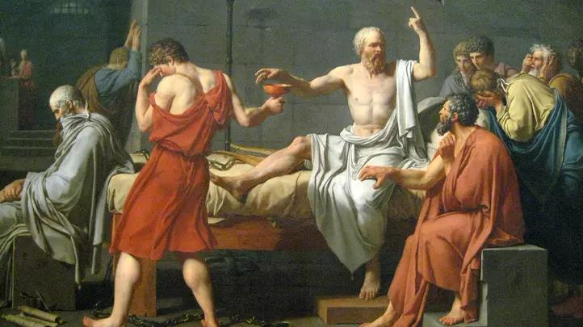

# Čím se athénská demokracie lišila od té naší?

Starověké Řecko byl zlatý věk demokracie, říká se. Jak to ale bylo s athénskou demokracií doopravdy? A máme to dneska lepší, nebo horší? {.lead}

Pojďme se podívat do Řecka, do doby někdy mezi 6. a 3. stoletím před Kristem. Athény i druhá města v Řecku se řídí systémem, kterému říkají demokracie, doslova lidovláda. To je systém založený na myšlence, že o veřejných věcech se rozhoduje ne podle toho, co si přeje nebo co považuje za dobré nějaký jednotlivec nebo skupina jednotlivců, nýbrž podle toho, co si přejí všichni, celý lid. Od té doby bude tahle myšlenka v evropské historii několikrát zapomenuta a několikrát se zase vrátí. Dneska už zase žijeme v době, kdy myšlenka demokracie udává prim. Jenže je naše demokracie to samé, co byla ta athénská? No, posuďte sami.

*Poznámka: Athénská demokracie trvala několik staletí a vyvíjela se. To, co si v následujícím přečtete, se týká hlavně doby mezi lety 508 a 322 před Kristem, která se považuje za její vrchol.*

## Rozdíl 1: Demokracie ano, ale jak pro koho

Občas se setkáme s představou, že athénská demokracie byla v nějakém smyslu čistá a opravdová, zatímco ta naše dnešní je nepravá, pokřivená. Jenže jak posoudit, kdy je demokracie čistá a kdy ne? Třeba podle toho, kdo je zahrnut do definice pojmu lid. Byla by iluze myslet si, že hlasovací právo měli v Athénách úplně všichni. Hlasovací právo měli jen muži, tím se nám definice pojmu lid rychle smrštila na polovinu. A navíc jen takoví muži, kteří nebyli přistěhovalci ani děti přistěhovalců, nebyli otroci (ano, v Athénách praktikovali otroctví) a měli splněnou vojenskou službu. Když to všechno podtrhnete a sečtete, vyjde vám, že až 80 % obyvatel bylo mimo hru. Z každých deseti lidí, které potkáte ráno cestou na trh, mají hlasovací právo jen dva, zbylých osm se musí přizpůsobit. Zní vám tohle jako čistá demokracie? Nebo spíš jako vlhký sen nějakého hyperkonzervativního fašisty?

Označovat athénskou demokracii za vládu lidu bez uvozovek a bez poznámek pod čarou, to můžeme jen tehdy, když budeme operovat s velmi účelovou definicí toho, co je a co není lid. Ano, v Athénách byla moc rozložena šířeji než třeba v nějaké monarchii. Ale demokracie z dnešního pohledu to taky nebyla. Z dnešního pohledu to byla spíš diktatura menšiny nad většinou. 

## Rozdíl 2: Parlament? Proč?

Athénská demokracie byla přímá demokracie: voliči se sešli na velkém veřejném shromáždění, tam debatovali a tam hlasovali. Kdybychom v dnešní době měli přímou demokracii athénského typu, měli bychom každou chvíli referendum. Pokaždé, když se o něčem hlasuje v parlamentu státu, v zastupitelstvu vaší obce, v zastupitelstvu vašeho kraje i v Evropském parlamentu, bylo by místo toho referendum – žádné parlamenty a žádná zastupitelstva by neexistovaly.

Chtěli byste to? Aby takový systém mohl fungovat v dnešní době, musel by každý rozumět všemu. Každý občan by musel být dobře informován o otázkách státních financí, veřejného zdravotnictví, organizace veřejné dopravy, regulace hospodářské soutěže, svozu odpadu, údržby veřejné zeleně, mezinárodní bezpečnostní situace… Když o takových otázkách necháte rozhodovat lidi, kteří jim rozumí jen povrchně, vystavujete se nebezpečí, že rozhodnutí, která padnou, budou nemoudrá, nerozumná a nepovedou k zamýšleným výsledkům. Takový je paradox přímé demokracie: funguje jen tehdy, když každý všemu rozumí, jenže v realitě skoro nikdo nerozumí ničemu. I tehdy v Athénách se o tomhle paradoxu vědělo, mezi kritiky systému patřila i známá trojice filozofů Sókratés-Platón-Aristotelés. Lepší recept ale neznali.

Dneska lepší recept známe, nebo aspoň myslíme, že je lepší: zastupitelská demokracie. To je ten systém, kdy o většině věcí rozhoduje veřejnost ne přímo, ale prostřednictvím volených zástupců. Každých pár let si zvolíme lidi, kteří jsou ochotni věnovat svůj čas a svoji kariéru tomu, že se budou zabývat řízením veřejných věcí, abychom my nemuseli. Jen si každý musíme dát pozor, aby naši poslanci a zastupitelé sdíleli naše hodnoty, aby potom v těch parlamentech a zastupitelstvech skutečně prosazovali naše zájmy.

I zastupitelská demokracie má svoje slabiny. Jedna z nich je, když se jako volič nechám omámit politickou reklamou a zvolím takového poslance, který ve skutečnosti nesdílí moje hodnoty a neprosazuje moje zájmy. Druhá slabina je, když se existencí parlamentů a zastupitelstev nechám uchlácholit do víry, že o veřejné věci se vlastně nemusím starat vůbec, protože se o to vždycky postará někdo „nahoře“. Oba tyhle jevy se dneska celkem běžně dějí, a to je ten důvod, proč máme leckdy dojem, že naše zastupitelská demokracie tak nějak nefunguje.

Ano, zastupitelská demokracie má fůru problémů. Jenže kdo hledá nápravu v návratu k přímé demokracii, ten ať si je laskavě vědom, že ta má taky fůru problémů, jen jiných.

## Rozdíl 3: Účast dobrovolně povinná

Být v Athénách voličem nebylo jen privilegium, to byla i povinnost. Od voličů se očekávalo, že se budou angažovat ve správě veřejných věcí. Kdo nechtěl, třeba protože ho to nebavilo nebo protože měl v životě na starosti důležitější věci, pro toho tam nebylo místo. Athénský státník Periklés to formuloval takhle: _U nás se každý zajímá nejen o své záležitosti, ale i o záležitosti státní. I ti, kdo si většinou jen hledí svého, jsou velmi dobře informováni o obecné politice – v tom je naše zvláštnost: my říkáme, že kdo u nás nedělá politiku, ten u nás vůbec nemá co dělat._

Život v Athénách byl komunální a kolektivní. Stáhnout se do soukromí a nechat veřejné záležitosti na jiných, to se netolerovalo. Zdá se vám to tak trochu totalitní a vynucené? To protože to takové je. V Athénách si angažmá u lidí vynucovali nátlakem, protože věděli, že demokracie může fungovat jen tehdy, když máte informované a angažované voličstvo – jinak se vše zvrhne do dysfunkce a chaosu. To koneckonců platí o obou typech demokracie, přímé i zastupitelské. Pokud si demokracii zredukujeme na to, že jednou za pár let to hodíme do volební urny kandidátovi s nejvemlouvavější reklamou a dál se o politiku nezajímáme, pak sami přispíváme k dysfunkci demokracie.

Ideální občan demokratického státu je angažovaný, vzdělaný a politicky nenaivní. Je to občan, který se zajímá o veřejné věci soustavně, nejen těsně před volbami. Je to občan, který dovede kriticky posoudit, co je v souladu s jeho zájmy a co ne, nenechá se omámit politickou reklamou. Jenže jak zařídit, aby lidé takoví skutečně byli? To je otázka za milión dolarů, na kterou hledáme odpověď už od dob starověkého Řecka.

