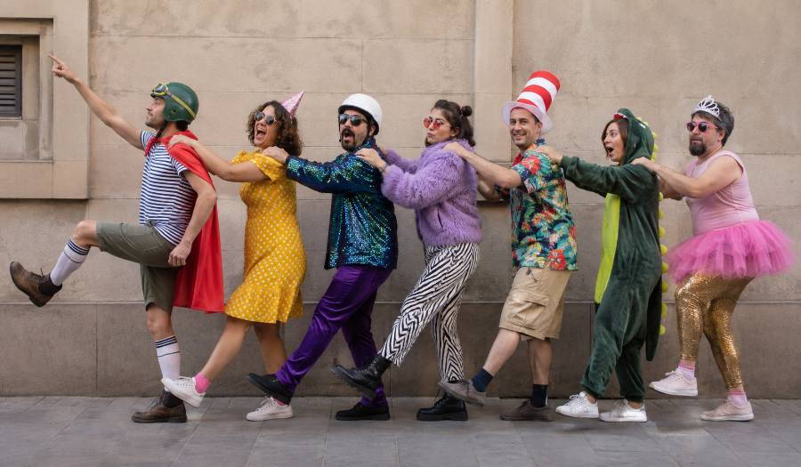

Aistriúchán ón Ghearmáinis ar an scéal ‘Wir sind das Volk’ ón leabhar ‘Vor uns die Sintflut’ leis an scríbhneoir Eilbhéiseach [Urs Widmer](https://en.wikipedia.org/wiki/Urs_Widmer). {.preintro}

# Is muidne an pobal

Urs Widmer {.author}

Is muidne an pobal agus tá 6,968,600 againn ann. Lúide 1,291,800 eachtrannach, dar ndóigh. Agus lúide 1,117,542 páiste nach bhfuil in aois vótála go fóill. Agus lúide líon beag daoine – níl a fhios agam cá mhéad, cúpla céad is dócha – ar coirpigh iad nó ar daoine iad atá chomh lagintinneach sin gur baineadh a gcearta sibhialta díobh. Fágann sin isteach is amach de 4,500,000 duine. Go bunúsach, gach dara duine a fheiceann tú sa tsráid ar lá gnóthach samhraidh, nuair a bhíonn an chathair lán de thurasóirí agus de chuairteoirí de chuile chineál sa bhreis ar mhuintir na háite, is cuid de phobal an stáit é nó í.

Ó thús ré an daonlathais, tá muidne an pobal ag máirseáil le chéile, ag teacht amach as an am atá caite, ag dul isteach san am atá romhainn. Scuaine fhada daoine ag spágáil leo go do-earráideach ó cheann ceann na haimsire. Leagann gach duine a lámh ar ghualainn an duine roimhe agus leanann sé a threoir. Is mar sin a shleamhnaíonn muid go léir in aon treo, na fir, na mná, a gcuid páistí. Daoine óga agus seandaoine. Muintir na tuaithe agus muintir na gcathracha. Daoine ramhra, daoine tanaí; daoine meabhracha, daoine dúra; daoine saibhre, daoine bochta; daoine sláintiúla, daoine breoite. Mar phobal, tá muid eagnaí agus gaoiseach. Ach mar dhaoine aonair, tá muid... bhuel, tá muid mar atá muid.

Duine amháin, tá sé ag coigilt airgid chun teach a cheannach. Duine eile, tá nós aige an crosfhocal a dhéanamh gach lá. Duine amháin, caitheann sé an iomarca ama ag breathnú ar an teilifís. Duine eile, ní ólann sé alcól riamh. Duine amháin, nuair a fuair sé a chéad phá cheannaigh sé carr daor ar léas, ach ní raibh sé in ann ag na haisíocaíochtaí agus bhí air an carr a thabhairt ar ais. Duine eile, tá ailse scamhóg air.

Sin seisear den phobal, agus níl ann ach na fir.

Bean amháin, tá sí buartha faoina meáchan. Bean eile, déanann sí barraíocht cainte agus labhraíonn sí i bhfad ró-ard. Bean amháin, tá sí cráifeach agus guíonn sí gach lá. Bean eile, cuireann sí dath éagsúil ar a cuid gruaige gach seachtain. Bean amháin, socraíonn sí an t‑aláram gach oíche le héirí go moch ar maidin chun dul ag rith, ach nuair a bhuaileann an t‑aláram ar maidin múchann sí é agus ní théann sí ag rith. Bean eile, tá sí andúileach do dhrugaí.

Anois tá dáréag ann.

Tá fear a chaith gloine beorach lena bhean tráth mar chuir sí olc air. Tá bean a phós fear nach raibh sí i ngrá leis, agus tá bean eile a phós fear a raibh. Tá fear pósta a luigh lena rúnaí oifige uair amháin agus gheall sé di a bhean a thréigeann, ach tháinig aiféala air agus níor thréig sé í. Tá seanfhear amháin nár phós riamh mar ní bhíodh sé réidh le ceangal a chur air féin go fóill, go dtí go raibh sé ródhéanach.

Fiche duine anois. Níos lú ná 1% den phobal! Gan dabht, tá an pobal rómhór le gach duine a áireamh. Fós féin, nach iontach an rud é go bhfuil an duine aonair mar atá sé – ar strae! trí chéile! as meabhair! – ach le chéile, mar phobal, tá fios ár mbealaigh againn? Tá ár lámha ar ghuaillí na ndaoine romhainn, tá muid cinnte gur ar bhóthar ár leasa atá muid, tá a fhios againn go mbainfidh muid an sprioc amach lá amháin. Tugann sé sin misneach duit, nach dtugann? Tá do smig in airde, tá tú ag máirseáil i dtreo na todhchaí, agus má dhéanann tú machnamh ar an duine atá i do dhiaidh, an duine a dtugann tú treoir dó, an duine a chuir a lámh ar do ghualainn agus a mhuinín ionat, ní rithfeadh sé leat – nó an rithfeadh? – gur seans nach leantóir atá sa duine sin in aon chor ach ceannaire, gur i dtosach na scuaine atá seisean agus tusa ag a deireadh, agus más ionann an cás do gach duine, gur i gciorcal síoraí atá muid ag máirseáil.
