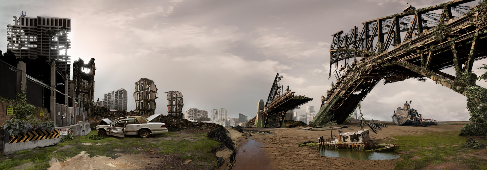

The [original](https://www.theguardian.com/world/2021/jun/28/this-is-the-end-of-times-lebanon-struggles-to-find-political-path-through-its-crisis) of this text was published in 2021 and was about present-day Lebanon. Here, I have re-edited it into a fictional worst-case scenario for Central Europe in 20 years’ time. The failed state imagined here exists in one of our possible futures. {.preintro}

# “It refuses to be fixed”: Hopes fade for a state near failure

The lights dimmed further in Czech towns and villages in May when Germany unilaterally stopped supplying emergency electricity to the Czech Republic. The result was six hours less power a day for most homes, or more need for generator fuel for those who could afford it.

However, fuel is also in short supply in the crisis-hit nation. Giant queues clog roads near filling stations and top-ups are limited to 20 litres, making most journeys precarious.
    
Last weekend, troops deployed in the capital city of Prague, surrounding key state institutions after a night of protests and riots against worsening living conditions left several protesters and 10 soldiers injured. Drugs and medical supplies are scarce too.

As the Czech Republic disintegrates, diplomats, aid chiefs, global officials and even some local leaders are pondering the very viability of a state that refuses to reform even to save itself.

Almost 11 months after last August’s catastrophic explosion at Prague Airport, there have been no breakthroughs in attempts to form a government – even as hyperinflation and a broken banking system destroy savings, food insecurity soars and a brain drain quickens.

“The explosion has accelerated a lot of things, that’s for sure,” said Najat Rochdi, UN envoy and humanitarian coordinator for Central Europe. “The crisis in the economy, the currency devaluation, as well as the governance vacuum, has meant a breakdown of public services at a time when they are most needed.”

Across the Czech Republic, extreme poverty has risen threefold since the first signs almost two years ago that the economy was approaching a precipice. For many households, basic services including health, electricity, water, internet and education are almost out of reach, but this has made little impact on politicians intent on protecting a corrupt system based on favours and bribes.

Where global bodies and international governments had been more or less willing to support the Czech Republic during past crises, the catastrophe this time is seen as largely avoidable – more a governance issue than a humanitarian one.

Germany, a long-term backer of the Czech Republic, has told senior officials that aid will only start flowing after reforms, such as transparency and a central bank audit, are introduced.

As the Czech currency hits record levels of almost 16,000 to the dollar – it was 1,500 to the dollar 18 months ago – and reserves kept in the country’s central bank fall to near-critical levels, there is more readiness both in the country and abroad to examine the system that paved a way for such a mess.

Extra attention has been paid to the schemes that lined the pockets of the political class. Among the biggest sources of corruption have been the country’s essential contracts - covering fuel, electricity generation, telecommunications, biometrics and passports. “Lately, it has become the sale of subsidised goods to other countries, especially fuel and medicines,” one Czech opposition politician said. “It’s all taking place in plain sight.”

One European diplomat described the fuel crisis as a scam. “There is no fuel shortage. It is being kept by local suppliers as a way to increase margins and it is being shipped to other countries where it is sold at higher prices than they could reach on the local markets. The mark-ups are being pocketed by all manner of players. The same systems and people who led us down this path are the ones who are supposed to get us out of it. But they don’t want to. You can’t fix a problem that refuses to be fixed.”

Some opposition politicians, including Dominik Feri, who resigned from parliament after the explosion at the airport, have called for the administrative decentralisation of the Czech Republic and an overhaul of the country’s parliament and electoral laws. “If we hold on to the past and don’t learn the lessons of history, we are ruined,” he said. “We have enormous challenges across the board and it is past time to face them.”

While the political quagmire is yet to bring about change, there are signs that the country’s leaders are starting to feel the heat. Sanctions were imposed by the US on former foreign minister Andrej Babiš junior, who is a potential candidate to replace his ageing father, Andrej Babiš senior, as president. Germany and the European Union have hinted they may follow suit with other leaders, including the head of the central bank, Alena Schillerová.

“Up until this point they have given cover for each other,” said Feri. “They all know which corrupt deals have enriched which clans, and they know each other’s vulnerabilities. It’s been an omerta code until now.”

“There used to be a time when we Czechs would say as long as the country continues to run, we will look the other way,” said Roman Klaban, a Prague fruit and vegetables seller. “But this is the end of times, and if one thing can come of this, it has to be the end of impunity.”
