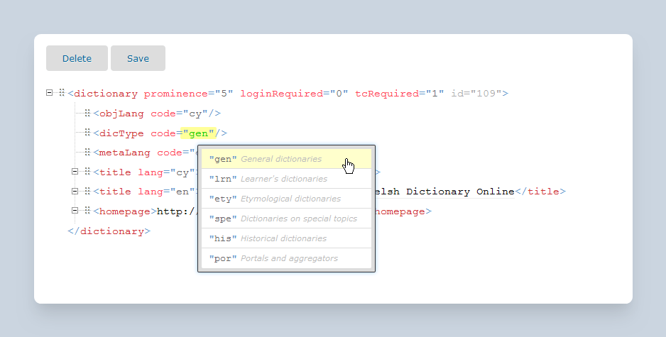

# How I reinvented the wheel and discovered projectional editing

Trust me, you want a code editor that doesn’t let you change the code. {.lead}

Back in 2014 I created an XML editor called [Xonomy](https://github.com/michmech/xonomy). It’s a code editor where you don’t edit code: instead, you edit an internal representation which is only *shown* to you as code. You edit this internal representation by clicking on things, navigating from one element to another, and making selections from menus. The motivation for designing an editor like this is to make it baby-proof: to prevent users from accidentally creating badly formed or invalid XML documents.

I can’t believe it took me nine years to accidentally discover that there is a name for this genre of editors: they’re called **projectional editors** and they’re common in the DSL (Domain-Specific Languages) universe. [Here’s a great introduction](https://www.freon4dsl.dev/010_Intro/010_Projectional_Editing) to the idea behind projectional editing from the website of one such editor, [Freon](https://github.com/freon4dsl/Freon4dsl). And [here’s a great video](https://www.youtube.com/watch?v=iN2PflvXUqQ&t=7s) about projectional editing from the makers of another such editor, [JetBrains MPS](https://www.jetbrains.com/mps/).

Outside the DSL universe, projectional editing is a wheel people seem to keep on reinventing again and again, without even calling it that. My Xonomy is one example. Another example is Thomas Hallgren’s [Grammatical Framework editor](https://cloud.grammaticalframework.org/gfse/about.html) which, exactly like Xonomy and Freon and others, makes you think you’re editing source code (in the [Grammatical Framework](https://www.grammaticalframework.org/) programming language), but actually you’re not: you’re pointing and clicking, and sometimes typing, but the thing you’re creating – the thing the editor sees – is not a stream of text, it’s a *structure*.

When you think about it, every editor in which you edit some kind of *structure* can be placed on a continuum:

- At one end of the continuum you have editors where you actually edit source code, with optional syntax highlighting and other bells and whistles. You probably use one of these every day if you’re a programmer. The source code you have written is then parsed into an Abstract Syntax Tree (AST), either by a compiler at compile-time, by an interpreter at run-time, or even by the editor itself while you type – which is how your code editor is able to give you those optional bells and whistles such as syntax highlighting and code completion. When you hit the save button, what gets saved is the source code itself, not the Abstract Syntax Tree. The Abstract Syntax Tree is a throw-away construct which a tool can derive from the source code whenever it needs it. 

- At the other end of the continuum you have diagrammatic editors where you manipulate graphic shapes on your screen. A typical example is vector graphics programs such as [Inkscape](https://inkscape.org/), [Adobe Illustrator](https://www.adobe.com/products/illustrator.html) and [CorelDRAW](https://www.coreldraw.com/en/), as well as diagramming software like [Visio](https://www.microsoft.com/en/microsoft-365/visio/flowchart-software) and [draw.io](https://www.drawio.com/). Another example is techniques such as [WYSIWYM](http://mcs.open.ac.uk/nlg/old_projects/wysiwym/)  and [Conceptual Authoring](https://europe.naverlabs.com/history/past-research/document-content-models/) which were experimented with in the NLG (Natural Language Generation) universe in the early 2000s for editing language-neutral meaning representations from which human-readable texts could be generated in multiple languages simultaneously (this technology didn’t really go anywhere outside its niche but that is beside the point now). In these programs, the graphics you see on screen are an impermanent rendering of an invisible internal structure. Everytime you do something on screen, you’re actually making a change to the internal structure, which is instantly re-rendered back onto your screen. When you save your work, it’s the internal structure which is saved, and when you re-open it, the on-screen shapes are reconstructed from it.

The advantage of text-based code editing is that it is quick and fluent, you get to do most of what you want to do through the keyboard instead of having to muck about with the mouse. Plus, plain-text is easy to copy and paste around. The disadvantage is that it’s easy to make a mistake, which is where those pesky syntax errors come from. Diagrammatic editors do not have this problem, they’re baby-proof and you simply *can’t* produce an invalid structure in them, but the downside is that they’re really slow-moving to work with: too much mousing around and not enough keyboarding. Projectional editing is an attempt to give you the best of both worlds: you work mostly with the keyboard and look mostly at text but, depending on where your cursor is, your keystrokes are translated into modifications of the underlying Abstract Syntax Tree – which are then instantly re-projected onto your screen, hence the name *projectional* editing.

Projectional editors have been around for some time. They certainly were around back in 2014 when I was beginning to tinker with Xonomy. I wish I knew about them then – if anything, I would have known how to explain what I was doing: I was building a projectional editor for XML.
