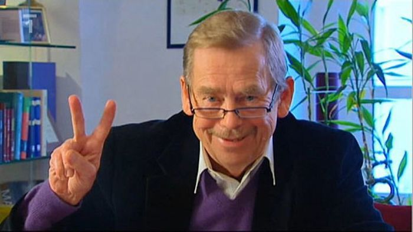

# ‘Níl ár dtír faoi bhláth’

Fuair [Václav Havel](http://ga.wikipedia.org/wiki/V%C3%A1clav_Havel) bás 18 Nollaig 2011 – an chéad uachtarán daonlathach a bhí ag an tSeicslóvaic tar éis imeacht na deachtóireachta cumannaí agus príomhphearsa sa ghluaiseacht i gcoinne na deachtóireachta céanna. Bhí meas agam ar Václav Havel riamh toisc nár pholaiteoir den ghnáthdhéanamh é. Intleachtóir ab ea é thar aon rud eile, duine meabhrach a raibh an coinsias mar chompás aige. Ní landálfadh duine mar seo sa pholaitíocht ach faoi chúinsí thar a bheith eisceachtúla. Ach bhí na cúinsí eisceachtúil, landáil Václav Havel sa pholaitíocht, agus ba chun sochair na tíre agus an domhain é. Ní thagann polaiteoir mar seo chun cinn i saol náisiúin ach uair i ngach 100 bliain, más chomh minic sin féin é. {.meta}

 {.center}

Ba mhór le Václav Havel prionsabail ar nós na gceart daonna, na cothromaíochta agus na fírinne. Chuir sé iad seo roimh Realpolitik na bpáirtithe agus tharraing sé aird orthu fiú nuair nár thaitin sé lena mhuintir féin: mar shampla, bhí sé de shíor ag tarraing airde ar dhíbirt na nGearmánach as an tSeicslóvaic tar éis an Dara Cogadh Domhanda, cé gur chuir sé sin míchompord ar mhuintir na Seicslóvaice féin. {.meta}

Cumarsáideoir deisbhéalach ab ea é agus d’fhág sé lear mór scríbhinní ina dhiaidh a mbeidh an saol ag tarraingt inspioráide astu go ceann na nglúnta. Mar ómós pearsanta don pholaiteoir eisceachtúil seo, shocraigh mé aistriúchán (giorraithe) a dhéanamh ar óráid chinn bhliana a thug Václav Havel ar theilifís na Seicslóvaice 1 Eanáir 1990. Is nós d’uachtaráin na tíre óráid a dhéanamh an chéad lá de gach bliain. Bhí Václav Havel díreach nuathofa mar uachtarán agus ba é an óráid seo an chéad deis aige a fhís a leagan amach dá náisiúin. Ní dóigh liom go raibh duine sa tír nach raibh ag éisteach leis an lá sin agus tá cuimhne ar an an óráid faoin teideal **Naše země nevzkvétá** (‘níl ár dtír faoi bhláth’). {.meta}

---

A chomhshaoránacha,

Le daichead bliain anuas, ar an chéad lá den bhliain, chloiseadh sibh na huachtaráin a tháinig romham ag insint an ruda chéanna daoibh: go bhfuil ár dtír faoi bhláth, go bhfuil an geilleagar faoi lánseol, go bhfuil muid go léir sona, go bhfuil muinín againn as ár rialtas agus nach bhfuil romhainn ach todhchaí iontach.

Ní dóigh liom gur chuir sibh san oifig seo mé le go n-inseoinn na bréaga céanna daoibh.

Níl ár dtír faoi bhláth. Tá monarchana na tíre ag táirgeadh rudaí nach bhfuil uainn. Tá an stát seo ag déanamh uirísliú ar an lucht oibre, cé go nglaonn sé ‘stát na n-oibrithe’ air féin. Tá an geilleagar ag cur amú fuinnimh cé go bhfuil easpa fuinnimh orainn. Bhíodh oideachas ár muintire ina chúis bróid ag ár dtír ach anois, tá cúrsaí oideachais in áit na leathphingine sa stát seo agus tá muid sa 72ú áit ar domhan. Loit muid an talamh, na haibhneacha agus na coillte a d’fhág ár sinsir dúinn agus is againne atá an timpeallacht is measa san Eoraip anois. Faigheann daoine sa tír seo bás níos luaithe ná in aon tír Eorpach eile.

Agus ní hé sin an chuid is tábhachtaí de. An rud is measa ná go bhfuil ár dtír lofa ó thaobh na moráltachta de. Tá muid tinn toisc gur nós linn rud amháin a rá agus rud eile a cheapadh. Is nós linn gan aon rud a chreidiúint, gan aon aird a thabhairt ar a chéile, gan a bheith ach ar son ár leasa féin. Is beag againn téarmaí ar nós an ghrá, an chairdis agus an chomhbhá. Tá an stát tar éis ‘acmhainn’ a dhéanamh den duine agus den dúlra. San áit a mbíodh daoine lácha díreacha agus geilleagar stuama, níl anois ach inneall gránna brocach nach dtuigeann aon duine cad chuige é.

Agus mé ag labhairt faoi chúrsaí moráltachta, ní ar na huaisle amháin atá mé ag trácht. Orainn go léir atá mé ag trácht. Tá muid go léir tar éis dul i dtaithí ar an deachtóireacht, ghlac muid léi mar fhíric dho-athraithe agus, tríd sin, thug muid tacaíocht di. I bhfocail eile, cé gur íospartaigh na deachtóireachta muid, is comhúdair na deachtóireachta muid freisin.

Cén fáth a bhfuil mé á rá seo? Ní ceart go gceapfadh aon duine gur rud a tháinig orainn ón taobh amuigh atá sa daichead bliain atá díreach imithe. Caithfidh muid glacadh leis an oidhreacht seo mar rud a rinne muid orainn féin. Má ghlacann muid leis sin, tuigfidh muid gur fúinn féin atá sé rudaí a chur ina gceart. Ní féidir linn an milleán ar fad a chur ar na ceannairí a bhí ann go dtí seo; ní hamháin nach mbeadh sé sin fíor ach laghdódh sé sin ar an fhreagrach atá romhainn go léir anois. Ná bíodh aon dul amú orainn: ní féidir leis an rialtas is fearr, leis an pharlaimint is fearr ná leis an uachtarán is fearr mórán a dhéanamh ina n-aonar. Ní bheidh saoirse ná daonlathas ann go mbeidh gach duine ag glacadh páirte agus freagrachta.

Má thuigeann muid an méid sin, ní bheidh oidhreacht na staire chomh scanrúil sin a thuilleadh agus fillfidh an dóchas inár gcroí.

Tá crann taca againn sa réabhlóid shíochánta a rinne muid sna seachtainí beaga anuas. Thaispeáin sé sin go raibh mianach moráltachta agus daonlathais inár sochaí fós, in ainneoin chuma na patuaire a bhí orainn leis na blianta. Chreid mé i gcónaí gur rud casta é gach sochaí agus gur féidir le sochaí ar bith athrú mór a dhéanamh. Tá áthas orm nach raibh dul amú orm. Tá an domhan ar fad ag déanamh iontais den dóigh ar bhain muidne, muintir a ceapadh a bhí umhal agus patuar, gur bhain muid ár saoirse amach, ar bhealach chomh síochánta sibhialta, taobh istigh de chúpla seachtain. Tá muid féin ag déanamh iontais de sin freisin. Agus fiafraíonn muid: cá as ar tháinig an flosc chun saoirse i ndaoine óga nár chuir aithne riamh ar aon chóras eile seachas an deachtóireacht? Conas gur thacaigh a dtuismitheoirí leo, glúin daoine a ceapadh a bhí caillte? Conas gur thuig a oiread daoine láithreach bonn cad is gá a dhéanamh, gan treoir ná comhairle?

Ceapaim go bhfuil dhá chúis leis an dea-thoradh seo. Ar an chéad dul síos, bíonn an duine daonna i gcónaí ábalta féachaint i dtreo idéal agus saoirse, fiú má tá an saol taobh amuigh ar a seacht ndícheall é a shin a mhúchadh ionat. Ar an dara dul síos, tá traidisiún daonlathais agus daonnachta ár dtíre beo fós agus d’fhan sé beo i gcónaí, é á chur ó ghlúin go glúin i bhfochoinsias na muintire, go dtí gur tháinig a lá arís.

Agus níor tháinig an tsaoirse seo gan chostas. Is iomaí duine a fuair bás i bpríosún sna 1950í, duine a scriosadh a shaol nó duine a díbríodh thar lear. Rinneadh géarleanúint orthu siúd a chuir i gcoinne an rialtais, orthu siúd a raibh sé de dhánaíocht iontu bheith dílis dóibh féin agus machnamh go neamhspleách. Ní ceart dearmad a dhéanamh d’aon duine a d’fhulaing ar son ár saoirse.

Ní ceart dearmad a dhéanamh ach oiread go bhfuil náisiúin eile tar éis praghas níos airde a íoc as a gcuid saoirse ná an praghas a d’íoc muidne. Doirteadh fuil le déanaí san Ungáir, sa Pholainn, sa Ghearmáin agus, ar bhealach thar a bheith brúidiúil, sa Rómáin; doirteadh fuil freisin sna náisiúin éagsúla san Aontas Sóivéideach. Ní ceart dearmad a dhéanamh de na haibhneacha agus farraigí fola seo toisc, gach áit a mbíonn daoine ag fulaingt, baineann sé le gach duine ar domhan. Ní ceart dearmad a dhéanamh ach oiread gur sna sála ar na heachtraí seo a bhain muidne ár saoirse amach. Murach athruithe tarlaithe cheana san Aontas Sóivéideach, sa Pholainn, san Ungáir agus sa Ghearmáin Thoir, ní tharlódh na hathruithe againne nó, dá dtarlódh, ní bheadh siad chomh síochánta céanna.

Cé go raibh dálaí idirnáisiúnta inár bhfabhar, ní chiallaíonn sé sin go raibh aon duine ná dream ag cuidiú linn. As ár stuaim féin a d’éirigh muid, gan taca ó aon stát eile. Feictear dom gur sa mhéid sin go háirithe atá infheistíocht mhorálta na móiminte seo. Ní bheidh orainn a thuilleadh bheith de shíor ag gabháil buíochais le haon dream eile. Anois a mhúsclófar ár bhféinmheas.

Ní hionann féinmheas agus sotal. A mhalairt: ní féidir ach le duine a bhfuil féinmheas aige éisteacht le daoine eile, maithiúnas a thabhairt dá naimhde agus brón a dhéanamh dá bhotúin féin. Cuirimis an féinmheas nua-aimsithe seo i bhfeidhm inár saol mar dhaoine i measc an phobail, agus mar stát i measc na stát eile.

B’fhéidir go bhfuil sibh ag fiafraí cén saghas poblachta atá uaim. Freagróidh mé: poblacht neamhspleách, shaor, dhaonlathach, poblacht a bhfuil ag éirí go maith léi go heacnamaíoch agus atá cóir go sóisialta san am céanna, poblacht a dhéanann fónamh don duine agus, dá bhrí sin, poblacht a bhfuil na daoine sásta fónamh dise. Poblacht le daoine oilte meabhracha mar, gan iad, ní féidir aon fhadhb a réiteach.

Ligigí dom mo chéad óráid a chríochnú le parafrása ar fhriotal de chuid Comenius: A phobal, tá riar do chúrsaí féin ar ais agat!
