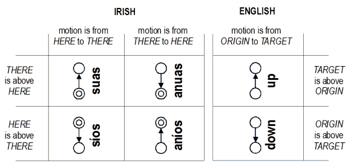

# The linguistic relativity of up and down

In this article, I am going to give a nice and simple example of how learning a new language causes you to start perceiving the world differently. By doing so I will provide support for the <a href="https://en.wikipedia.org/wiki/Linguistic_relativity">Sapir-Whorf hypothesis</a> (in its weak form), which is a hypothesis that claims that the language you speak predetermines, to some extent, how you think. I will demonstrate this on my favourite toy language, Irish. {.lead}

---

My example concerns the Irish equivalents for the English adverbs <em>up</em> and <em>down</em> when these describe motion, as in <em>I am going up</em> or <em>the sun is coming down</em>. I will call them <strong>adverbs of vertical motion</strong>. Notice that <em>up</em> and <em>down</em> can also be used as adverbs of vertical <u>position</u>, as in <em>I am up</em> or <em>the sun is down</em>. That is not what we are dealing with here, though. Here, we will only concern ourselves with their use for motion.

Ready? OK, let’s go. Learners of Irish as a second language often have trouble wrapping their heads around the fact that, where English only has two vertical motion adverbs, namely <em>up</em> and <em>down</em>, Irish has four, namely <strong>suas</strong>, <strong>aníos</strong> (both meaning <em>up</em>), <strong>síos</strong>, <strong>anuas</strong> (both meaning <em>down</em>). Consider the following examples.

> <strong>Tá mé ag dul <u>suas</u>.</strong> <em>I am going up.</em>  
> <strong>Tá mé ag teacht <u>aníos</u>.</strong> <em>I am coming up.</em>

> <strong>Tá mé ag dul <u>síos</u>.</strong> <em>I am going down.</em>  
> <strong>Tá mé ag teacht <u>anuas</u>.</strong> <em>I am coming down.</em>

Clearly, if Irish needs four words instead of two, then the words encode some additional semantic information. What is this additional information?

Before we begin to understand that, let’s understand first what the English adverbs encode. Both <em>up</em> and <em>down</em> assume that there is motion going on, in a vertical direction, between an origin and a destination. With <em>up</em>, the destination is above the origin and with <em>down</em>, the destination is below the origin. So far so good: there is only one binary contrast to encode, therefore exactly two adverbs are needed. This seems simple and logical, a monolingual English speaker might be fooled into thinking that this is the only way to conceptualize vertical motion.

Irish will force you to reconsider that, though. In Irish, each of the four vertical motion adverbs encodes not one but two binary contrasts. The first contrast is whether the motion is happening upwards or downwards, like English. The second contrast is something we might call perspective: whether the object is moving away from <em>‘here’</em> or towards <em>‘here’</em>. With that in mind, we can rephrase the four Irish adverbs like this.

> <strong>Suas</strong> really means <em>from down here to up there</em>.  
> <strong>Aníos</strong> really means <em>from down there to up here</em>.

> <strong>Síos</strong> really means <em>from up here to down there</em>.  
> <strong>Anuas</strong> really means <em>from up there to down here</em>.

For those who like diagrams, here is a diagram that summarizes the contrasts encoded in each adverb. In the diagram’s Irish half, the concept of <em>‘here’</em> is indicated by a double circle and <em>‘there’</em> is a simple circle. In the English half, perspective is irrelevant, so there are only simple circles. Notice that while English only needs one axis, Irish needs two. Two axes with two values each, that makes 2 × 2 = 4 possible permutations, hence four distinct adverbs are needed.

{.center}

One terminological clarification is in order. I have used the labels <em>‘here’</em> and <em>‘there’</em> to indicate perspective. These terms do not necessarily refer to the position of the speaker. If I am describing motion from someone else’s perspective, such as when recounting how my grandmother got scared as she heard somebody coming up the stairs, then the labels <em>‘here’</em> and <em>‘there’</em> will be in relation to my grandmother’s position, not mine. I could just as well invent fancy terminology such as <em>focus position</em> for <em>‘here’</em> and <em>secondary position</em> for <em>‘there’</em>, but I thought the homely <em>‘here’</em> and <em>‘there’</em> made the whole story easier to follow.

OK, let’s stop and review. While English vertical motion adverbs encode only one semantic contrast, Irish ones encode two. The implication for you as a (hypothetical) learner of Irish is that you must start paying attention to things you have probably ignored in English until now. Every time you want to say that something is moving up or down, you are required to throw the variable of perspective into the equation. You must decide from whose perspective you are telling the story and you must express that decision through your choice of adverbs. This is a constraint Irish imposes on its speakers, and people who are functionally bilingual or multilingual will agree that this is not unusual: every language imposes its own constraints as to what must not be left unexpressed (as well as liberties as to what may).

So here we have an example of how one language forces you to pay attention to aspects of reality that you can ignore in another. Or, to put it the other way around, here we have an example of how one language invites you to ignore aspects of reality that another draws your attention to. In other words, different languages make you perceive the world differently. <a href="https://en.wikipedia.org/wiki/Linguistic_relativity">Messrs Sapir and Whorf</a> were (at least partially) right.
