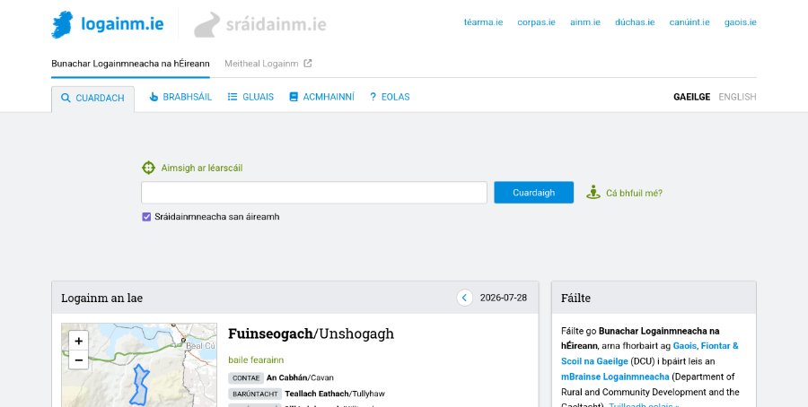

# The UX of toponymy

We need to talk about the user experience of the websites we build as front-ends for our placenames databases. {.lead}

(This article is based on – but not completely identical to – my talk ‘Between a map and a gazetteer: the user experience of toponymic websites’ which I gave at the *Placenames and Ecology in the European Context* workshop at Dublin City University in July 2026.) {.meta}

One thing I’ve learned from my work as a software developer on the [Placenames Database of Ireland](https://www.logainm.ie/) is that it matters how you design the **user experience** of the website. When you’re running a placenames project you’re probably building a database of placenames and you’re probably making it available to the public through a website. A few decades ago that website may have been a printed book but today the output is typically a website. So, what should a good placenames website be like, what features should it have, what kind of user experience should it offer? Don’t just ask your software developer to “build a website”. Think it through and ask yourself questions such as the following.

**How is the search feature going to work?** You’re probably planning to have a search box where people can type a *query* and you’re going to be responding to them with *search results*, typically lists of places whose names match that query. Deciding when a placename you have in your database matches whatever the user has typed in is not as straightforward as you might think, given that people often search for strange things: misspelled names, parts of names, non-standard names, even things that aren’t names at all, including entire sentences.

If your website is going to be serving members of the general public, not all of whom can be expected to know the first thing about toponymy, then you need to worry about this. If your website is oriented more towards specialists who already know what to expect, then you need to worry about this less, but you still need to worry about it a certain amount. Modern search engines such as Google have gotten people accustomed to the fact that you can almost always get good search results even if the query is not perfectly formulated. It’s our job as website builders to match that level of convenience.

**What other features are you going to have besides search?** Are you even sure that most users will be coming to your website with a specific query in mind? Some are probably going to want to browse around and see what’s available. What browsing features can you build on top of a database of placenames? Do you want to have a map-based browsing feature where people can pan and zoom an interactive map and click on pins? Or perhaps a hierarchical browsing feature where people can get lists of the townlands in a specific parish and suchlike?

Given what you know about your expected end-users, is it worth investing effort into building such features, or would that be a wasted effort? There are (at least) two kinds of user personas to consider. One is someone like a journalist, a translator or a bureaucrat working in some organisation who uses your website in order to find out how to correctly refer to a specific place which they are (for example) about to mention in a text they are writing. The other is someone like a local school teacher from somewhere who is curious about placenames in their local area. The first one needs a good search feature but doesn’t have much use for a browsing feature, the second one probably wants both. So, know your user! 

**Is your website more like a map or more like a gazetteer?** In toponymy we have a contrast between placenames as something which *belongs on a map* and placenames as something which can be *listed and tabulated* away from a map, like a traditional gazetteer. Because placenames have this double life in two different mediums, a placenames website can decide to go one way or the other. Are we going to be a map-based website with a pannable, zoomable map over the entire screen where all the interaction happens? Or are we going to be a text-based website where we basically show *lists* of things to people? Or some kind of hybrid approach where we do both?

This decision will have consequences for the user experience people get on your website. If you decide to go with the textual, gazetteer-like approach, then that is a comfortingly convenient format for working with lists of search results and suchlike because those can be sorted (for example by relevance to the query) and split into pages (if the list is very long). On the other hand, people probably *want* to see where their search results are on a map because the spatial aspect does matter with placenames: for example if all the matches for my search are near one another then I’d like to know that. But doing things like sorting and paging is difficult to do well on a map surface. In fact I have yet to see a good map-based search interface; most I’ve seen have a tendency to disintegrate into an infuriating mess once the search results get a little complex (yes I’m looking at you Google Maps).

So, thinking about how and how much you’re going to feature maps on your website is important for user satisfaction. It could also be a skill issue for your software developers because map-based interfaces are generally harder to build and not all website builders can do it well.

**In what tone are we speaking to the end-user?** By tone I mean, are we *describing* or are we *prescribing*? A prescriptive placenames website is one which gives people guidance on the correct or recommended names for places. A descriptive placenames website is one which simply presents the names that are known to exist or to have existed for a given place but doesn’t pass judgement if there is variation, disagreement or controversy out there. Descriptive toponymy can be either synchronic (documenting names that are used at present) or diachronic (documenting names that are known to have been used in the past, possibly up to the present).

These parameters may be set for your project from the start but I think that, when setting them, you should allow yourself to be informed by the expectations of your target audience. If you’re targeting mainly other placenames researchers or enthusiasts (remember the local school teacher persona from earlier?) then the descriptive diachronic approach is what these end-users will probably welcome. If on the other hand you are targeting an audience who are going to be coming to your website with pragmatic needs – people who just need placenames as a means to some other end, like the above-mentioned journalists, translators and bureaucrats – then I would recommend that you don’t shy away from passing judgement and making recommendations on which names are “correct” and which not.

I understand that placenames experts can feel uneasy about being prescriptive to people because the backstory behind a placename can be complex and nuanced. But if your mission is to serve mainly users with pragmatic needs, then prescription is not a dirty word. These people *want* to be prescribed to, provided they know they can trust your judgment. They probably just want to grab the placename they came here for and switch quickly back to whatever their main task is, without having to read research or form their own opinions.

In other words, it’s about knowing your users once again. The actual user base may be mixed, with some percentage of pragmatic users and some percentage of enthusiasts. Do you know what those percentages are roughly, or can you make reasonable assumptions about this? Getting a feel for these parameters early on in the project, and setting your website design priorities accordingly, will make a difference between a website which resonates well with its target audience and one which doesn’t.

**So, what have we learned from all this?** We have learned that user experience matters. User experience – or just “UX” – is a buzzword people who build websites speak about a lot. It’s a broad umbrella term for things like the usability, the ergonomics, the ease of use and the user-friendliness of a digital product such as a website, an app, or any piece of software intended to be used by humans.

User experience is not just an IT concept, it has a long prehistory outside of IT dealing with the design of physical products. The idea is that products need to be designed not only to do whatever it is they are supposed to do, but also to do it in such a way that the experience of using them ends up being comfortable, intuitive and pleasant – as opposed to awkward, frustrating and unsatisfactory. This applies to everything people build for other people – including the user interfaces of toponymic websites.

