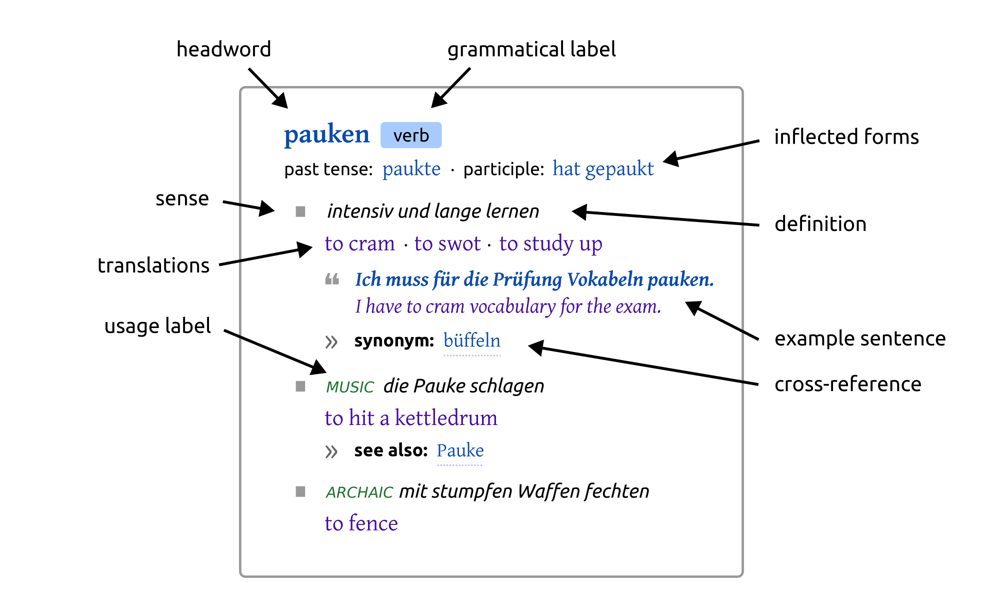

# What is and isn’t lexicography 

Lexicographers love debating what their discipline actually is. Here’s my take.  {.lead}

**Note:** This article is an edited extract from my PhD thesis [Data Structures in Lexicography](../pdf/thes.pdf). {.meta}

When I talk about lexicography I usually mean *human-oriented lexicography*, the kind of activity where we build dictionaried intended for human users. I will explain in this article what human-oriented lexicography is, in my opinion. I will do that in two steps. First, I will set human-oriented lexicography apart from other kinds of lexicographic activities in natural language processing (NLP) and in language technology. Second, I will take you on a short guided tour through the types of content that we usually work with in human-oriented dictionaries: entries, senses, definitions and many others. OK, let’s go. 
  
## What is a dictionary?
  
The typical product of lexicography is a *dictionary*. A dictionary can take the form of a printed book or, more likely these days, a digital product presented to users on the screens of their computers and mobile phones. This section will clarify how human-oriented dictionaries differ from other digital artefacts that provide information about words such as NLP-style “language resources”, wordnets, framenets and word embeddings.
    
### Dictionaries versus “language resources”
    
The term lexicography I say it usually refers to the discipline which produces dictionaries and other language-related reference works *intended for consumption by human users*. The emphasis on human users is important here. I’m not talking about machine-understandable language resources here such as semantic networks, frame lexicons and morphological databases. The discipline which produces such datasets is sometimes called lexicography too but it is a different offshoot of lexicography than the one this article is about.
      
Why is it important to distinguish between dictionaries for humans on the one hand and language data for machines on the other? After all, both disciplines have roughly the same goal: to organize information about the words of one language or another, and to make that information available to whoever needs it. Why does it matter, then, whether the consumer is a human person or a computer application? Your initial intuition may be that once a dictionary originally written for humans is encoded on a computer, it will immediately become useful for applications in natural language processing such as word-sense disambiguation and machine translation. Or, looking at it the other way around, you might think that a computational lexicon such as [WordNet](https://wordnet.princeton.edu/) or [FrameNet](https://framenet.icsi.berkeley.edu/) should be useful for humans to look up words in. True, such crossovers are not completely unheard of. Dictionary content originally produced for humans *is* occasionally found useful for other applications: a classical example is the grammatical coding system in *Longman Dictionary of Contemporary English* (published in 1978) which found good use in natural language processing [in the 1980s](https://aclanthology.org/J87-3002/). And perhaps there are people who do satisfy their linguistic information needs by looking words up in WordNet and FrameNet instead of a *Collins*, a *Merriam-Webster* or a Wiktionary. But such synergies are rare. On the whole, the two camps are separate: there are dictionaries for humans and there are lexical resources for machines, with little overlap.
      
This is not just an artefact of ignorance, of factions failing to talk to each other. There are deeper reasons for this. Human-oriented dictionaries tend to communicate facts about language in ways which, while not explicit enough for computer applications, are optimized for human cognitive abilities. Computational lexicons, on the other hand, tend to represent lexical knowledge in ways which can be rather alien to humans, especially humans who are not computational linguists. And this divide, if anything, is getting wider with the arrival of machine-learned language models such as word embeddings: these represent lexical knowledge in ways even more alien and more inaccessible to inspection than hand-crafted WordNet-style resources.
      
In fact, the structure of *any* machine-oriented lexical resource has almost nothing in common with the structure (both micro- and macro-) of a typical human-oriented dictionary. For this reason, it is valid to study the data structures of human-oriented dictionaries separately from the data structures present in computational lexicons. In this article, we’re looking at the former without getting distracted by the latter.
      
### Dictionaries versus “lexical databases”
    
Dictionaries do not simply list off all facts that can be known about a word. Good dictionary authors are careful about what they include and exclude in a dictionary entry, depending on the dictionary’s purpose and target audience: whether it is a dictionary for decoding or encoding, a dictionary for native speakers or for learners, if learners then which level, and so on. The principle of *selection of information* is important in dictionary production, it is how lexicographers respond to the intended *lexicographic function* of the dictionary (in the sense defined by [Sven Tarp](https://www.degruyterbrill.com/document/doi/10.1515/9783484970434/html)) and to the perceived *information needs* (in the information-scientific sense of the term) of its end-users.
      
In contrast to this stands the concept of *lexical* (or *lexicographic*, or *lexicographical*) *database*: a “structured resource that contains as much lexicographic information as possible regarding words and lexical units in a language” (@Horák and Rambousek 2018, p. 185). These databases are not dictionaries. They are something from which a dictionary may be derived later, either automatically by setting a few parameters, or manually by human lexicographers. Examples of such databases include [Cornetto](https://doi.org/10.1007/978-3-642-30910-6_10) (Dutch), [DANTE](https://www.dantedictionary.com/) (English) and [EKILex](https://euralex.org/publications/unified-data-modelling-for-presenting-lexical-data-the-case-of-ekilex/) (Estonian). [Wikidata Lexemes](https://www.wikidata.org/wiki/Wikidata:Lexicographical_data) can also be understood as such a database, this one being multilingual. Unlike a dictionary, a lexical database is there to meet the information needs of the *lexicographers*, not the dictionary end-users. A lexical database is neutral in terms of its lexicographic function: it can fulfill multiple functions depending on what the lexicographer decides to include or exclude.
      
Are the structures of lexical databases within the scope of human-oriented lexicography? That depends. Some lexical databases, such as Cornetto, are organized in structures reminiscent of machine-oriented WordNet-like resources where the main organizing principle is a *network* of lexical units. These databases are relatively far away (structurally speaking) from the eventual dictionary that may be derived from them. For that reason, they are out of scope here. Then there are lexical databases such as DANTE whose data structure is very similar to that of a finished dictionary: the primary organizing principle is a collection of *entries* subdivided into *senses*, with very little explicit networking between them. A good way to think about a lexical database like DANTE is that it is a semi-finished human-oriented dictionary, an “almost-dictionary” which needs some amount of editing (but no structural transformation) before it is ready to start fulfilling some lexicographic function and meeting the information needs of end-users. The structures of such databases are very much within the scope of human-oriented lexicography.
      
## What is inside a dictionary?
  
Now that we have defined which kinds of dictionaries are in scope, let us take a look inside them: let us look at the kinds of content typically found in dictionaries. This section will be useful to readers who do not have a background in lexicography, as an introduction to the entities that inhabit this domain.
    

      
### Entries and headwords
    
A dictionary is a collection of **entries**. Dictionary entries are not continuous text (like paragraphs in a novel or encyclopedia). The style of the language inside them tends to be “telegraphic”, the only items that consist of full-formed sentences are usually the examples (and sometimes the definitions, for that see below). They are highly structured, they resemble multi-level bulleted lists rather than continuous text, and they are rarely read from beginning to end in their entirety: a typical user, once they have located the entry which they believe will satisfy their information need, will briefly scan the entry before eventually zooming in on the part that interests them.
      
In printed dictionaries the entries have traditionally been arranged alphabetically by the entries’ headwords, in electronic dictionaries the entries are stored in some form of database and brought on the user’s screen in response to what the user has searched for. The principle by which entries are organized in a dictionary is called the dictionary’s *macrostructure*, while the internal structure of the entries themselves is the dictionary’s *microstructure*.
      
Each entry typically begins with a **headword**. The rest of the entry describes the headword, typically by giving a numbered list of the headword’s **senses**. The way a dictionary approaches the lexicon of a language can therefore be described as *semasiological*: it starts from a word and asks, which meanings does this word have? (The opposite would be an *onomasiological* approach: starting from a defined meaning or concept and asking, which words express this meaning? This is the approach taken in terminology studies and also in various wordnets and framenets).
      
Most of the time, the lexicographic concept of a *headword* is identical to what a lexicologist or a computational linguist might call a *lemma*: a canonical word form, such as the nominative singular of a noun or the infinitive of a verb, which represents a possibly very large set of inflected word forms (all the cases of a noun, all the tenses of a verb). But not all headwords are lemmas. Sometimes lexicographers decide to give headword status to individual word forms if they believe that this will be useful for the user. An example would be Czech *vlas* ‘a hair’ whose plural *vlasy* has meanings that are partially unpredictable: not just ‘hairs’ but also ‘headhair’. In such a situation the lexicographer may well decide that *vlasy* needs its own entry. In addition to that, sub-word units such as suffixes and prefixes are often treated as headwords too, and in recent years we see a tendency to treat multi-word items, such as various idioms and set phrases, as headwords as well. (At that point *headword* becomes a misnomer: the term implies a single-word expression whereas modern dictionaries may contain entries headed by multi-word “headwords”.)
        
The headword is often followed by one or more of the following items:
      
- **Grammatical labels** which indicate its part of speech (= whether it is a noun, a verb, an adjective etc.) and other grammatical properties such as noun gender or verbal aspect.
      
- Various **inflected forms** of the headword: the plural of nouns, the past tense of verbs and so on. In richly inflected languages dictionaries do not usually list *all* possible inflected forms of the headword because such lists would be too long and distracting (for example, for a Czech noun that would be up to 14 word forms: seven grammatical cases in the singular and seven again in the plural). Lexicographers normally choose a handful of representative forms to indicate to the user how the word inflects in broad terms.
      
- An indication of the headword’s **pronunciation**. In printed dictionaries this is often given as a transcription in (some variant of) the International Phonetic Alphabet (IPA) or in some kind of simplified “phonetic spelling”. In digital dictionaries pronunciation is increasingly being offered as sound recordings which the user can listen to.
      
### Senses
    
The largest part of a dictionary entry is usually taken up by an ordered list of senses. Each sense represents one of the possibly many meanings of the headword. The senses are typically presented as a bulleted or numbered list. In printed dictionaries the senses were often all presented inline, without line breaks between them, to save space. Modern on-screen dictionaries are usually more generous in their use of whitespace and the senses are formatted as visually separated block-level elements with generous whitespace between them.
      
The senses of a lexicographer are not necessarily the same thing as the senses of a lexicologist or a cognitive linguist. In disciplines where researchers are interested in how a person’s mental lexicon is organised, it is seen as important to distinguish between situations when two “readings” of a word constitute separate senses and when not. For example, the two readings of *bank* (a financial bank versus the bank of a river) would be considered separate senses (because you can never mean both at the same time, not even in an ambiguous sentence like *we finally reached the bank*) but the two readings of the financial sense (an institution versus a building) would not be considered separate senses (because you can mean both at the same time, as in *I work in a bank*) – these two readings would more likely be described by a lexicologist as *facets*, *microsenses* or *ways-of-seeing* of the same sense. But most of this is only of limited relevance to a lexicographer’s job. A lexicographer may well decide to present facets to the dictionary user as separate senses (or subsenses), or to merge two senses into one, if he or she believes that this will be useful to the end-user (= that it will satisfy the user’s information needs). This illustrates an important point about human-oriented lexicography in contrast to lexicology: a lexicographer’s mission is not necessarily to express facts which are true with respect to some linguistic theory but to present those facts in ways which are going to be useful, helpful, relevant and easy to understand for a human dictionary user. So: the term *sense* does not have much of any deep theoretical meaning in lexicography, it is just a unit of organising information: basically nothing more than a synonym for “an item on a list”: similarly to how a *headword* is not the same thing as a *lemma*.
      
The order in which the senses are presented usually matters: lexicographers often deliberately arrange senses according to some principle such as frequency of use (most common senses first), chronology (historically oldest – or newest – senses first), a perceived “basicness” (literal senses first, metaphorical extensions after), age of acquisition (in children’s dictionaries) or learner level (e.g. according to [CEFR](https://en.wikipedia.org/wiki/Common_European_Framework_of_Reference_for_Languages)).
      
High-frequency headwords typically have a lot of senses while low-frequency headwords often only have one. In traditional printed dictionaries, when an entry contains only a single sense, if often happens that the sense is not marked up in any obvious way from the rest of the entry. In modern born-digital dictionaries, the senses of an entry are always marked up explicitly (typically using some XML element such as `<sense>`), even if there is only one of them.
      
A sense typically consists of items such as the following:
      
- A **definition**: a sentence which explains the meaning of that sense. Definitions are usually in the same language as the headword. Different dictionaries have different *defining styles*. Some definitions are formal and written strictly in such a style that one could almost replace the headword with them (“[collide: to hit something violently](https://dictionary.cambridge.org/dictionary/english/collide)”) while others use a more chatty, full-sentence style which re-uses the headword (“[if two or more moving people or objects collide, they crash into one another](https://www.collinsdictionary.com/dictionary/english/collide)”). The latter is popular in pedagogical dictionaries for second-language learners and some authors prefer calling such definitions *explanations* rather than *definitions*. In addition to (or instead of) definitions/explanations, senses sometimes start with short “mini-definitions” (also called indicators, disambiguators, signposts or glosses) whose purpose is to help the user locate the desired sense quickly when scanning a long entry visually. In modern born-digital dictionaries definitions are sometimes supplemented or even replaced by graphics.
      
- **Translations** of the headword if the dictionary is bilingual. Some translations are simple and straightforward equivalents of the headword, but in complicated cases, when the target language does not have a straightforward equivalent, these can be *explanatory translations* which read almost like definitions, but in the target language. Translations can be just strings of text, or they can be annotated with additional information such as grammatical labels, transcriptions of pronunciation and so on, depending on the purpose of the dictionary.
      
- **Example sentences** which show how the headword is used in context. Lexicographers include example sentences in a dictionary for many different purposes. In a pedagogical dictionary for second-language learners, the purpose of examples is to show models of good usage which the learner would do well to imitate. In dictionaries for native speakers the purpose of examples may be less to serve as a model of good usage and more to clarify the sense, together with the definition. And in historical dictionaries the examples may be there primarily to attest, to prove that the sense exists or existed. Example sentences may or may not come with source attributions, may or may not have sound recordings of pronunciation, and may or may not be translated.
      
- **Collocates** of the headword, that is, words that often accompany the headword in real-world language use: adjectives that often modify the head noun, verbs that often have this noun as subject or object, and so on. Traditionally, it has *not* been very common for dictionaries to have collocates (unless it was a specialized collocations dictionary) but it has been becoming more common in recent decades, mainly because collocates are relatively easy to extract from corpuses and because they are often the basis on which senses are identified.
      
- **Cross-reference** to other (senses of other) entries in the same dictionary, such as links to synonyms and antonyms.
      
The purpose of all this sense-level content is to describe meaning: the semantics and the pragmatics of the headword. In contrast, the purpose of entry-level content such as part-of-speech labels and pronunciation transcriptions is to describe the formal properties of the headword: its morphology, morphosyntax, phonology and orthography. An ideal which lexicographers sometimes aspire to is to have a clear division between formal and semantic properties of the headword: the formal properties belong at the entry-level and are understood to be shared by all the senses, while the semantic properties belong at the sense-level and are specific to each individual sense. In practice, this ideal is sometimes relaxed, and senses sometimes contain formal information too. For example, if a noun has two different plural forms and these are associated with two separate senses, then the plurals may be given at the level of the senses, rather than at the level of the entry.
      
Senses are often arranged in a flat list without hierarchy, but in some more complex dictionaries there may be a hierarchical list of senses and subsenses. The entry structure in such dictionaries can be understood as recursive: senses can contain other senses.

## Making dictionaries machine-readable
  
If you have read this far, you should have a pretty clear understanding by now of what human-oriented lexicography is about. I hope I have convinced you that dictionaries are a very specific text type. Representing them on computers – which is something people have been doing since the 1980s if not earlier – is a different task from text encoding in the likes of HTML, LaTeX or DocBook. In a text encoding scenario, the typical goal is to mark up things like paragraphs and itemized lists, as well as inline structures such as stretches of “strong” and “emphasised” text (≈ bold and italic). Digital lexicography aims at a higher level of abstraction, the goal is to represent the domain-specific content types discussed above, such as senses and definitions, as well relationships between them. Doing that is the job of [people like me](../), IT professionals who build dictionary writing systems, dictionary websites and other lexicographic tools. If that sort of thing interests you, read my other article [A short history of digitisation in lexicography](../digitisation-in-lexicography/).

